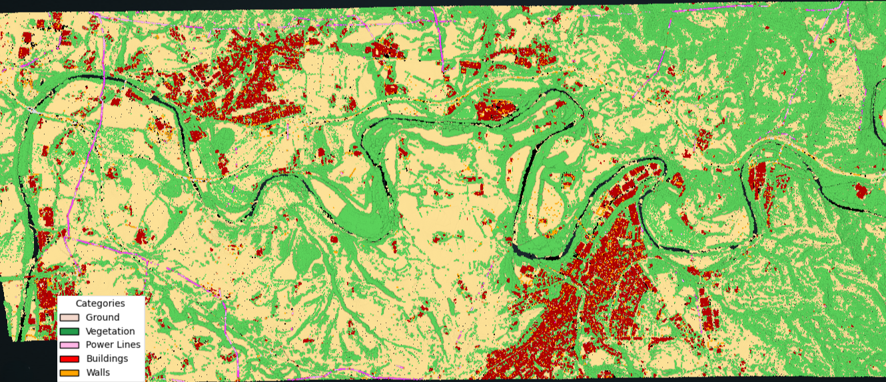
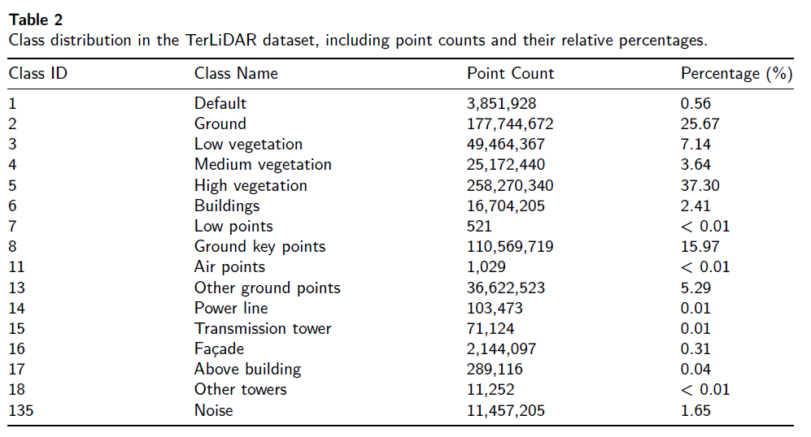
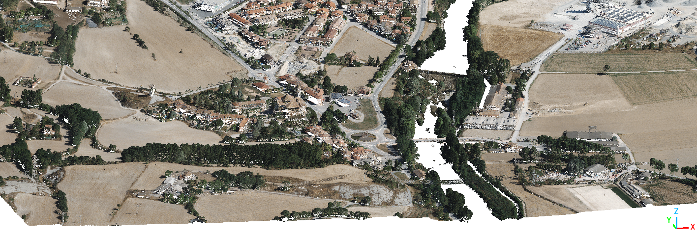
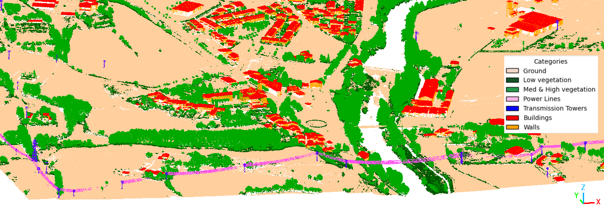

# aidl-2026-3d-semantic-segmentation

3D Semantic Segmentation with PointNet for LAS point cloud files.

Source: [TerLiDAR Dataset & Our work in LoRA for PointNet++ in Airborne LiDAR Semantic Segmentation](https://github.com/marionacaros/terlidar)

## Quick Start Guide

### Installation

```bash
conda create -n lora-pn2 python=3.10 -y
conda activate lora-pn2
pip install -r requirements.txt
```

### 1. Explore Data

Analyze LAS data:

```bash
python analyze_dataset.py --data_dir data
```


### TerLiDAR Dataset
TerLiDAR Dataset is a fully open and annotated airborne LiDAR dataset that covers ~51.4km of urban and forested areas along the Ter River in Catalonia, Spain. The data were acquired in July 2021 using an ALS system mounted on a georeferenced aircraft operated by ICGC. The dataset comprises 692 million colorized 3D points, each annotated with one of the semantic classes listed in the paper.

<p align="center">
  
</p>
<p align="center">
  <em>
    Geographic coverage of the TerLiDAR dataset along the Ter River in Catalonia, Spain.  
  </em>
</p>

<p align="center">
  
</p>

The classes are described as follows:
1. **Default** – Points that could not be classified during the classification process.  
2. **Ground** – Points belonging to the terrain.  
3. **Low vegetation** – Points corresponding to low vegetation such as shrubs, crops, and the lower parts of trees (0.3 m < height ≤ 2.0 m).  
4. **Medium vegetation** – Points belonging to medium vegetation, which may include taller shrubs, crops, and parts of tree canopies (2.0 m < height ≤ 3.0 m).  
5. **High vegetation** – Points corresponding to high vegetation, primarily points within tree canopies (height > 3.0 m).  
6. **Buildings** – Points generally classified on building rooftops.  
7. **Low Points** – Points with negative height relative to the ground, usually sensor noise.  
8. **Ground key points** – Simplified points previously classified as ground (Class 2), used for constructing the Digital Terrain Model.  
9.  **Air points** – Points detected above the terrain, often spurious returns.  
10. **Other ground points** – Points near the ground, such as those pertaining to grass, that could not be classified as ground.  
11. **Power lines** – Points representing electric power lines.  
12. **Transmission tower** – Points representing electrical towers.  
13. **Façade** – Points belonging mostly to building façades.  
14. **Above buildings** – Points located above buildings, such as chimneys, solar panels, or awnings.  
15. **Other towers** – Points corresponding to towers not classified as transmission towers (e.g. observation towers). 
16.  **Noise** – Points identified as noise produced by the sensor.  


<p align="center">
  
  
</p>
<p align="center">
  <em>
    Visualization of a LAS tile using RGB values and corresponding semantic classes.
  </em>
</p>

<!-- ERROR: Ignored the following versions that require a different python version: 0.36.0 Requires-Python >=3.6,<3.10; 0.37.0 Requires-Python >=3.7,<3.10; 1.3.3 Requires-Python >=3.11; 2025.11.11 Requires-Python >=3.11; 2025.8.2 Requires-Python >=3.11; 2026.1.1 Requires-Python >=3.11; 7.0.0 Requires-Python >=3.11; 7.0.0rc1 Requires-Python >=3.11; 7.0.1 Requires-Python >=3.11; 7.0.2 Requires-Python >=3.11; 7.1.0 Requires-Python >=3.11; 7.1.0rc1 Requires-Python >=3.11; 7.1.1 Requires-Python >=3.11; 7.2.0 Requires-Python >=3.11; 7.2.0rc1 Requires-Python >=3.11; 7.2.0rc2 Requires-Python >=3.11; 9.0.0 Requires-Python >=3.11; 9.0.0b1 Requires-Python >=3.11; 9.0.0b2 Requires-Python >=3.11; 9.0.1 Requires-Python >=3.11; 9.0.2 Requires-Python >=3.11; 9.1.0 Requires-Python >=3.11; 9.2.0 Requires-Python >=3.11; 9.3.0 Requires-Python >=3.11; 9.4.0 Requires-Python >=3.11; 9.5.0 Requires-Python >=3.11; 9.6.0 Requires-Python >=3.11; 9.7.0 Requires-Python >=3.11; 9.8.0 Requires-Python >=3.11; 9.9.0 Requires-Python >=3.11
ERROR: Could not find a version that satisfies the requirement nb-conda-kernels==2.3.1 (from versions: none)
ERROR: No matching distribution found for nb-conda-kernels==2.3.1 -->