# 3D Semantic Segmentation on LiDAR Data

## Table of Contents

- [3D Semantic Segmentation on LiDAR Data](#3d-semantic-segmentation-on-lidar-data)
  - [Table of Contents](#table-of-contents)
  - [Folder Structure](#folder-structure)
  - [How to Run the Code](#how-to-run-the-code)
    - [Local Setup](#local-setup)
    - [DALES Segmentation](#dales-segmentation)
      - [Preprocessing](#preprocessing)
      - [Training](#training)
      - [Testing](#testing)
      - [Visualization](#visualization)
    - [Running on Google Cloud VM](#running-on-google-cloud-vm)
      - [Environment setup](#environment-setup)
      - [NVIDIA driver installation](#nvidia-driver-installation)
      - [Verify GPU access](#verify-gpu-access)
  - [Experiment Tracking (W\&B)](#experiment-tracking-wb)
    - [What is logged](#what-is-logged)
    - [Configuration](#configuration)
    - [Offline usage](#offline-usage)
  - [Metrics](#metrics)
    - [Intersection over Union (IoU)](#intersection-over-union-iou)
      - [Implementation](#implementation)
    - [Mean Intersection over Union (mIoU)](#mean-intersection-over-union-miou)
  - [PointNet Architecture](#pointnet-architecture)
    - [Why PointNet for aerial LiDAR?](#why-pointnet-for-aerial-lidar)
    - [Implementation (`src/models/pointnet.py`)](#implementation-srcmodelspointnetpy)
  - [PointNet Architecture Validation](#pointnet-architecture-validation)
    - [ShapeNet Part Segmentation Task](#shapenet-part-segmentation-task)
    - [Metrics](#metrics-1)
    - [Dataloader implementation](#dataloader-implementation)
    - [Experiments](#experiments)
    - [Qualitative Resuls](#qualitative-resuls)
    - [Quantitative Results](#quantitative-results)
    - [Conclusions](#conclusions)
  - [DALES Dataset](#dales-dataset)
    - [DALES Dataset Preprocessing](#dales-dataset-preprocessing)
    - [Geospatial Validation](#geospatial-validation)
  - [Optimizer and Learning Rate](#optimizer-and-learning-rate)
    - [Configuration](#configuration-1)
  - [Input Feature Selection](#input-feature-selection)
    - [Hypothesis](#hypothesis)
    - [Implementation (`config/default.yaml`)](#implementation-configdefaultyaml)
    - [Experiment Setup](#experiment-setup)
    - [Results](#results)
    - [Conclusions](#conclusions-1)
  - [Class Balancing Strategies](#class-balancing-strategies)
    - [Focal Loss vs NLL Loss](#focal-loss-vs-nll-loss)
      - [Hypothesis](#hypothesis-1)
      - [Implementation (`src/utils/focal_loss.py`)](#implementation-srcutilsfocal_losspy)
    - [Class Weight Strategies](#class-weight-strategies)
      - [Hypothesis](#hypothesis-2)
      - [Implementation](#implementation-1)
    - [Class Balanced Sampler](#class-balanced-sampler)
      - [Hypothesis](#hypothesis-3)
      - [Implementation (`src/utils/sampler.py`)](#implementation-srcutilssamplerpy)
    - [Experiment Setup](#experiment-setup-1)
    - [Results](#results-1)
    - [Conclusions](#conclusions-2)
  - [Data Augmentation](#data-augmentation)
    - [Hypothesis](#hypothesis-4)
    - [Implementation (`src/models/dataset.py`)](#implementation-srcmodelsdatasetpy)
    - [Experiment Setup](#experiment-setup-2)
    - [Results](#results-2)
    - [Conclusions](#conclusions-3)
  - [Dropout](#dropout)
    - [Hypothesis](#hypothesis-5)
    - [Implementation](#implementation-2)
    - [Experiment Setup](#experiment-setup-3)
    - [Results](#results-3)
    - [Conclusions](#conclusions-4)
  - [PointNet on DALES - Incremental Improvements (Validation)](#pointnet-on-dales---incremental-improvements-validation)
  - [IPointNet: BEV-Point Cloud Fusion](#ipointnet-bev-point-cloud-fusion)
    - [Full-Density BEV Generation](#full-density-bev-generation)
    - [Point Cloud and BEV Alignment](#point-cloud-and-bev-alignment)
    - [Image Encoder and Initial Global Fusion](#image-encoder-and-initial-global-fusion)
    - [Local BEV Feature Fusion](#local-bev-feature-fusion)
    - [Implicit BEV Neighborhood](#implicit-bev-neighborhood)
    - [IPointNet Architecture](#ipointnet-architecture)
    - [Results](#results-4)
    - [Key Insight](#key-insight)
    - [Conclusion](#conclusion)
  - [PointNet++](#pointnet)
    - [Encoder](#encoder)
      - [1. Farthest Point Sampling (FPS)](#1-farthest-point-sampling-fps)
      - [2. Neighborhood Grouping](#2-neighborhood-grouping)
      - [3. A Shared MLP + Max Pooling](#3-a-shared-mlp--max-pooling)
    - [Decoder](#decoder)
      - [1. 3-NN Interpolation](#1-3-nn-interpolation)
      - [2. Concatenation with Skip Features](#2-concatenation-with-skip-features)
      - [3. Shared MLP Refinement](#3-shared-mlp-refinement)
    - [Network Architecture](#network-architecture)
      - [Encoder Architecture (SA Layers)](#encoder-architecture-sa-layers)
      - [Decoder Architecture (FP layers)](#decoder-architecture-fp-layers)
    - [Experiments](#experiments-1)
      - [Hypothesis](#hypothesis-6)
      - [Results](#results-5)
      - [Discussion](#discussion)
      - [Final Model](#final-model)
  - [Comparing Three Architectures (Validation and Test Sample Results)](#comparing-three-architectures-validation-and-test-sample-results)
  - [Future Work](#future-work)

---

## Folder Structure

```
aidl-2026-3d-semantic-segmentation/
├── config/
│   └── default.yaml                 # All hyperparameters, paths, and preprocessing settings
├── data/
│   ├── dales_las/                   # Raw LAS point cloud tiles
│   │   ├── train/
│   │   └── test/
│   ├── dales_las_BEV_FULL/          # BEV rasters for blocks
│   │   ├── train/
│   │   └── test/
│   └── dales_blocks/                # Preprocessed NPZ blocks
│       ├── train/
│       └── test/
├── figs/                            # Saved figures and visualizations
├── logs/                            # Training logs
├── model_objects/                   # Saved final model (.pth / .pt)
├── snapshots/                       # Per-epoch snapshots (snap_interval in config)
├── src/
│   ├── main.py                      # DALES training entry point
│   ├── test.py                      # DALES evaluation entry point
│   ├── train_shapenet.py            # ShapeNet training entry point
│   ├── generate_full_density_bev_rasters_from_las.py     # Preprocessing: LAS → BEV rasters
│   ├── convert_las_to_blocks.py     # Preprocessing: LAS → NPZ blocks
│   ├── compute_class_frequencies.py # Compute class frequencies & corresponding weights
│   ├── tune_ray.py                  # Ray Tune hyperparameter search
│   ├── viz_blocks_matplotlib.py     # 2D block visualization
│   ├── viz_blocks_open3d.py         # 3D Open3D visualization
│   ├── viz_critical_points.py       # PointNet critical point visualization
│   ├── viz_pred_vs_label.py         # Prediction vs. ground truth comparison
│   ├── models/
│   │   ├── pointnet.py              # PointNet segmentation model
│   │   ├── pointnetplusplus.py      # PointNet++ (baseline comparison)
│   │   └── img_encoder.py           # 2D CNN encoder for BEV features
│   └── utils/
│       ├── config_parser.py
│       ├── dales_label_map.py
│       ├── dataset.py               # DALES Dataset loader + augmentation
│       ├── shapenet_dataset.py      # ShapeNet Dataset loader + augmentation
│       ├── evaluator.py
│       ├── focal_loss.py            # Focal Loss implementation
│       ├── sampler.py               # Class Balancing sampler for train dataloader
│       ├── trainer.py               # Training loop + W&B logging
│       └── trainer_for_ray.py       # Trainer adapted for Ray Tune
├── requirements.txt
└── wandb/                           # Offline W&B run cache
```

---

## How to Run the Code

### Local Setup

```bash
conda create -n aidl-2026-project python=3.10 -y
conda activate aidl-2026-project
pip install --no-cache-dir -r requirements.txt
wandb login   # one-time setup, stores API key locally
```

---

### DALES Segmentation 

#### Preprocessing

Download DALES las files to `./data/dales_las`. Data can be requested using the form provided at the following [page](https://sites.google.com/a/udayton.edu/vasari1/research/earth-vision/dales).

Create BEV rasters by running (run from the repo root):

```bash
python src/generate_full_density_bev_rasters_from_las.py --las_root "./data/dales_las"
```

Convert raw LAS tiles to fixed-size NPZ blocks (run from the repo root):

```bash
python src/convert_las_to_blocks.py
```

Block size, stride, and feature extraction settings are configured in `config/default.yaml` under `data_preprocessing:`.

#### Training

```bash
python src/main.py
```

Override training hyperparameters without editing the YAML:

```bash
python src/main.py --num_epochs 100 --batch_size 16 --dropout_rate 0.3
```

Available CLI arguments: `--model_name`, `--num_points`, `--batch_size`, `--num_epochs`, `--dropout_rate`.

Paths, preprocessing settings, and loss weights must be changed in `config/default.yaml` directly.

#### Testing

```bash
python src/test.py
```

Results (accuracy, mIoU, per-class IoU) are printed to stdout and logged to W&B.

#### Visualization

```bash
python src/viz_blocks_matplotlib.py    # 2D bird's-eye view of blocks
python src/viz_blocks_open3d.py        # Interactive 3D point cloud viewer
python src/viz_critical_points.py      # Highlights PointNet critical points
python src/viz_pred_vs_label.py        # Side-by-side prediction vs. ground truth
```

---

### Running on Google Cloud VM

Besides our local resources, we also used a Google Cloud VM with the following configuration:

- **Machine type:** n1-standard-4 (4 vCPUs, 15 GB memory)
- **GPU:** 1 × NVIDIA T4
- **Boot disk:** 150 GB, Balanced persistent disk
- **Image:** Deep Learning on Linux - Deep Learning VM with CUDA 12.4 M129 (Debian 11, Python 3.10)

#### Environment setup

After connecting via SSH:
```bash
# Install Miniconda
wget https://repo.anaconda.com/miniconda/Miniconda3-latest-Linux-x86_64.sh
bash Miniconda3-latest-Linux-x86_64.sh

# Accept conda terms of service
conda tos accept --override-channels --channel https://repo.anaconda.com/pkgs/main
conda tos accept --override-channels --channel https://repo.anaconda.com/pkgs/r

# Install git
sudo apt update
sudo apt install git
```

#### NVIDIA driver installation

The Deep Learning VM image ships without a driver by default. To install one:
```bash
sudo sed -i '/bullseye-backports/d' /etc/apt/sources.list

wget https://developer.download.nvidia.com/compute/cuda/repos/debian11/x86_64/cuda-keyring_1.1-1_all.deb
sudo dpkg -i cuda-keyring_1.1-1_all.deb

sudo sed -i 's/^deb https:\/\/deb.debian.org\/debian bullseye main$/deb https:\/\/deb.debian.org\/debian bullseye main contrib non-free/' /etc/apt/sources.list
sudo sed -i 's/^deb https:\/\/deb.debian.org\/debian bullseye-updates main$/deb https:\/\/deb.debian.org\/debian bullseye-updates main contrib non-free/' /etc/apt/sources.list

sudo apt update
sudo apt install -y nvidia-driver
sudo reboot
```

#### Verify GPU access

After creating the virtual environment similarly with miniconda:
```bash
conda create -n aidl-2026-project python=3.10 -y
conda activate aidl-2026-project
pip install --no-cache-dir -r requirements.txt
```

Verify GPU access:
```bash
python -c "import torch; print(torch.cuda.is_available()); print(torch.cuda.get_device_name(0))"
```

---

## Experiment Tracking (W&B)

All training runs are tracked with [Weights & Biases](https://wandb.ai). The project is `dales-semantic-segmentation`, entity `aidl-3d-semantic-segmentation`.

### What is logged

**Per epoch during training** (`src/utils/trainer.py`):
- `Loss/Train`, `Loss/Validation`
- `Accuracy/Train`, `Accuracy/Validation`
- `mIoU/Train`, `mIoU/Validation`
- `Learning_Rate`

**During test** (`src/test.py`):
- `Loss/Test`, `Accuracy/Test`, `mIoU/Test`
- Per-class IoU: `IoU/Ground`, `IoU/Vegetation`, `IoU/Buildings`, `IoU/Vehicle`, `IoU/Utility`

**3D visualizations** are logged as W&B Tables with columns `epoch`, `GT` (ground truth point cloud), `Prediction`, `Errors`, `Uncertainty`. To keep storage manageable, only the first, middle, and last epoch are logged.

### Configuration

```yaml
wandb:
  enabled: true
  project: dales-semantic-segmentation
  entity: aidl-3d-semantic-segmentation
  mode: online   # online | offline | disabled
```

### Offline usage

If the VM has no outbound internet access, set `mode: offline`. Runs are cached locally under `wandb/` and can be synced afterward:

```bash
wandb sync wandb/
```

---

## Metrics

Evaluating the performance of a semantic segmentation model requires metrics that measure how well the predicted labels match the ground truth labels. In the case of point cloud segmentation, the task consists of assigning a semantic class to every point in the cloud. While classification accuracy measures the proportion of correctly labeled points, it is often not a reliable metric for segmentation tasks because datasets are usually highly imbalanced. For example, in LiDAR datasets large portions of the scene may correspond to dominant classes such as ground or vegetation, while other classes such as vehicles or utilities appear much less frequently.

In such situations, a model could achieve high accuracy simply by predicting the dominant classes, even if it fails to correctly predict rare classes. For this reason, Intersection over Union (IoU) is widely used as a more robust metric for segmentation evaluation.

---

### Intersection over Union (IoU)
Intersection over Union (IoU) measures the overlap between the predicted region for a class and the corresponding ground truth region. The IoU for a class is defined as

$$
IoU = \frac{TP}{TP + FP + FN}
$$

where:

- **TP (True Positives):** points that belong to the given class and are correctly predicted by the model ("correct predictions")

- **FP (False Positives):** points that the model predicts as belonging to the given class, but whose true label is different ("incorrect predictions")

- **FN (False Negatives):** points that belong to the given class, but are incorrectly predicted by the model ("missed detections")


Example: _IoU for building_
- TP: a point labeled as _building_ that is also predicted as _building_
- FP: a point labeled as _vegetation_ that is predicted as _building_
- FN: a point labeled as _building_ that is predicted as _vegetation_

This formula can also be interpreted as the ratio between the **intersection** and the **union** of the predicted and ground truth sets of points:

- the **intersection** corresponds to the points correctly predicted as belonging to the class (TP)

- the **union** corresponds to all points that belong to the class either in the prediction or in the ground truth (TP + FP + FN)


#### Implementation

For each class, the intersection and the union are computed for every batch and accumulated over the entire epoch. Then, their ratio gives a single IoU value per class and epoch:

$$
IoU_c = \frac{\sum_{b} intersection_c}{\sum_{b} union_c}
$$

where the sum is perfomed over all batches b in the epoch. 

---

### Mean Intersection over Union (mIoU)

In semantic segmentation tasks, IoU is computed independently for each class. To obtain an overall measure of segmentation performance across all classes, the mean Intersection over Union (mIoU) is used.
The mIoU is defined as the average IoU over all classes:

$$
mIoU = \frac{1}{C} \sum_{c=1}^{C} IoU_c
$$

where:
- $C$ is the number of classes
- $IoU_c$ is the IoU for class $c$

By averaging over classes, mIoU ensures that all classes contribute equally to the evaluation, preventing dominant classes from disproportionately influencing the metric. This makes mIoU particularly suitable for segmentation tasks in datasets with class imbalance. Unlike accuracy, which can be dominated by frequent classes, mIoU evaluates segmentation performance independently for each class and therefore provides a more reliable measure of overall segmentation quality.

---

## PointNet Architecture

### Why PointNet for aerial LiDAR?

DALES is an aerial LiDAR dataset: each tile contains millions of unordered 3D points. PointNet operates directly on raw point sets (no grids, no images) so it preserves the full spatial precision of the original data. This matters when distinguishing small objects like vehicles and utility poles.

The key design insight is **permutation invariance via symmetric aggregation**: a shared MLP processes each point independently, and a max-pool over all points produces a global feature that is invariant to point ordering. This makes PointNet a natural fit for point clouds, which have no canonical order.

### Implementation (`src/models/pointnet.py`)

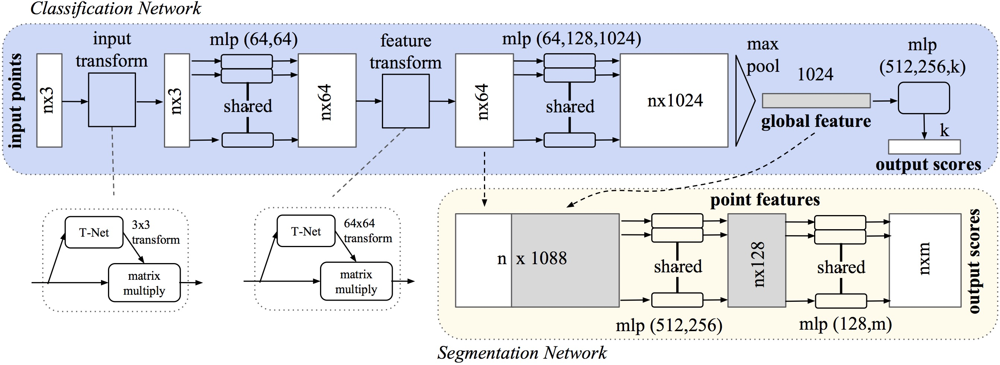

The model has three components:

**1. T-Net (TransformationNet)**

A mini-network that predicts a `k×k` transformation matrix to align the input (or its features) before processing. This is the spatial transformer idea applied to point clouds.

Architecture: shared MLP over points (`Conv1d`) with channels `k → 64 → 128 → 1024`, then global max-pool to a 1024-dim vector, then three FC layers `1024 → 512 → 256 → k×k`. The output is initialized as identity plus a learned offset, which stabilizes early training.

Two T-Nets are used: one on the raw 3D input (3×3) and one on the 64-dim feature space (64×64).

**2. PointNetBackbone**

| Stage | Operation | Output shape |
|---|---|---|
| Input transform | T-Net (3×3) applied to XYZ | `[B, N, 3]` |
| Shared MLP | Conv1d: `num_channels → 64 → 64` | `[B, 64, N]` |
| Feature transform | T-Net (64×64) applied to 64-dim features | `[B, 64, N]` |
| Point features | Conv1d: `64 → 128 → 1024` | `[B, 1024, N]` |
| Global feature | MaxPool over N points | `[B, 1024]` |
| Per-point concat | Local 64-dim + broadcast global 1024-dim | `[B, 1088, N]` |

**3. Segmentation head**

Takes the 1088-dim per-point feature vector and passes it through a shared MLP: `1088 → 512 → 256 → 128 → num_classes`, with dropout applied before the final layer. Output is passed through `log_softmax`.

**N.B.:** The original paper implements segmentation without dropout. We include a dropout parameter for experimentation but default it to 0 to match the paper's behavior.

**4. Classification head** (`PointNetClassification`)

Used for whole-cloud classification tasks (e.g., ModelNet and ShapeNet part classification). Takes only the **global feature** `[B, 1024]` from the backbone (not the per-point concatenation) and passes it through FC layers with batch norm: `1024 → 512 → 256 → num_classes`. Dropout is applied before the final layer, and the output is `log_softmax` over classes.

The key difference from the segmentation head is the input: classification uses the global max-pool feature alone (one prediction per cloud), while segmentation concatenates the global feature with per-point local features to produce one prediction per point.

---

## PointNet Architecture Validation

The goal of the following experiments is to validate the implementation of the PointNet network [1](https://arxiv.org/pdf/1612.00593)
For this task, we decided to run experiments using ShapeNet dataset as stated in the original work

The first implementation show in [PointNet architecture](###implementation) is used to run a train/test/validation with the ShapeNet dataset


### ShapeNet Part Segmentation Task

The dataset has been downloaded from [Kaggle]( https://www.kaggle.com/datasets/mitkir/shapenet/download?datasetVersionNumber=1) web site as stated in the [torch_geometric](https://pytorch-geometric.readthedocs.io/en/latest/_modules/torch_geometric/datasets/shapenet.html) documentation.

The dataset is splitted in train,test,validation as shown in the following table.

|        |  Air    |  Bag    |  Cap    |  Car    |  Cha    |  Ear    |  Gui    |  Kni    |  Lam    |  Lap    |  Mot    |  Mug    |  Pis    |  Roc    |  Ska    |  Tab    |
|:------:|:------:|:------:|:------:|:------:|:------:|:------:|:------:|:------:|:------:|:------:|:------:|:------:|:------:|:------:|:------:|:------:|
| TRAIN  |  1958.0 (72.8%)  |  54.0  (71.0%)  |  39.0  (70.9%)  |  659.0  (73.4%)  |  2658.0 (70.7%)  |  49.0  (71.0%)  |  550.0  (69.9%)  |  277.0  (70.7%)  |  1118.0  (72.3%)  |  324.0  (71.8%)  |  125.0  (61.9%)  |  130.0  (70.6%)  |  209.0  (73.8%)  |  46.0  (69.7%)  |  106.0  (69.7%)  |  3835.0  (72.8%)  |
|  EVAL  |  341.0  (12.7%) |  14.0  (18.4%) |  11.0  (20.0%) |  158.0  (17.6%) |  704.0  (18.7%) |  14.0  (20.3%) |  159.0  (20.2%) |  80.0  (20.4%) |  286.0  (18.5%) |  83.0  (18.4%) |  51.0  (25.2%) |  38.0  (20.6%) |  44.0  (15.5%) |  12.0  (18.2%) |  31.0  (20.4%) |  848.0  (16.1%) |
|  TEST  |  391.0  (14.5%) |  8.0  (10.5%) |  5.0  (9.1%) |  81.0  (9.0%) |  396.0 (10.5%) |  6.0 (8.7%) |  78.0  (9.9%) |  35.0 (8.9%) |  143.0 (9.2%) |  44.0 (9.8%) | 26.0  (12.9%) |  16.0  (8.7%)   |  30.0 (10.6%)  |  8.0  (12.1%)  |  15.0  (9.9%) |  588.0 (11.1%) |

The goal results for the model are shown in the following table:

|       |  MEAN  |   Air   |   Bag   |   Cap   |   Car   |   Cha   |   Ear   |   Gui   |   Kni   |   Lam   |   Lap   |   Mot   |   Mug   |   Pis   |   Roc   |   Ska   |   Tab   |
|:-----:|:------:|:-------:|:-------:|:-------:|:-------:|:-------:|:-------:|:-------:|:-------:|:-------:|:-------:|:-------:|:-------:|:-------:|:-------:|:-------:|:-------:|
| PointNet  |  83.7  |  83.4  | 78.7  | 82.5  |  74.9  |  89.6  |  73.0  |  91.5  |  85.9  |  80.8  |  95.3  |  65.2  |  93.0  |  81.2  |  57.9  |  72.8  |  80.6  |

### Metrics

The measure for the experiments is mean Intersection over Union mIoU(%), with an extra compensation in objects that may have a missing label part.

$$
mIoU = (\frac{1}{C} \sum_{c=1}^{C} IoU_c) + (\frac{ml}{C})
$$

where:
- $C$ is the number of classes
- $IoU_c$ is the IoU for class $c$
- $ml$ is the number of missing part labels

For example Plane class object has part labels [0,1,2,3] but an object in the batch may have only part labels [0,1,2] then a value of 1/4 is added in the mIoU metrics. This avoids a punishment in the metrics for non present parts in an object. 

This compensation of the metrics is used in the metrics of the original work. 

---

### Dataloader implementation

To be able to use the compensated IoU measure, and one hote vector class index, we had to create a custom dataloader. This will allow us to return with the element, the compensated IoU value, and the index of the object class that is also needed in the next steps.

The dataloader is based on the [torch_geometrics](https://pytorch-geometric.readthedocs.io/en/latest/_modules/torch_geometric/datasets/shapenet.html) implementation, and can be found in [shapenet_dataset.py](src/utils/shapenet_dataset.py)

---

### Experiments

All the experiments will be run using the following configuration:

```yaml
  learning_rate: 0.01          # Initial LR passed to Adam
  scheduler_type: cosine       # Only supported option currently
  scheduler_min_lr: 0.00001    # Floor LR (eta_min in CosineAnnealingLR)
  num_epochs: 50               # Also used as T_max for the scheduler
  num_points: 1024
  batch_size: 32
  random_noise: mean 0 std dev 0.02
  rotation_arround_up_axis: 0.7
```

To run the experiments the file [train_shapenet.py](src/train_shapenet.py) is used.

The main function has 3 sub-functions:
+ train_shapenet: This function is used to train the model, it generates metrics for the train and validation split
+ test_sahapenet: This function is used to test the model, it generates metrics for the test split.
+ showPointCloudResults: This function executes visualization with matplotlib, for a batch in the test split.


**1. PointNet base model**

First we do a train/evaluation run 

The base model gives the following results

|       |  MEAN  |   Air   |   Bag   |   Cap   |   Car   |   Cha   |   Ear   |   Gui   |   Kni   |   Lam   |   Lap   |   Mot   |   Mug   |   Pis   |   Roc   |   Ska   |   Tab   |
|:-----:|:------:|:-------:|:-------:|:-------:|:-------:|:-------:|:-------:|:-------:|:-------:|:-------:|:-------:|:-------:|:-------:|:-------:|:-------:|:-------:|:-------:|
|TRAIN  |  72.5  |  75.3  |  67.6  |  77.4  |  61.7  |  85.6  |  61.6  |  85.6  |  78.1  |  83.2  |  93.8  |  45.2  |  73.6  |  76.2  |  48.2  |  63.4  |  84.1  |
| EVAL  |  70.3  |  76.4  |  69.0  |  47.1  |  63.4  |  86.9  |  58.5  |  85.9  |  80.3  |  80.2  |  93.6  |  47.0  |  80.9  |  71.1  |  37.6  |  64.2  |  81.9  |

We can see that the results are quite different from the original work. 
Going deep in the original work, they state the following changes in the architecture for improving part segmentation task:

+ Adding a one-hot vector for the object class and concatenate it in the final embedding
+ Adding skip connections and concatenate them in the final embedding
+ increase layer sizes in all the network

The network with the improvements for the part segmentaiton taks stated in the original work is shown in the following image
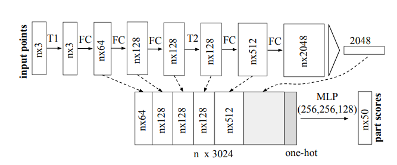

With the specified changes, the following experiments are planned:

+ Pointnet + one-hot vector
+ Pointnet + skip connections
+ Pointnet + one-hot vector + skip connections
+ Increase layer sizes on architecture with best results
 

The results for the experiments are shown in the following tables

**2. PointNet + One-Hot vector**

|       |  MEAN  |   Air   |   Bag   |   Cap   |   Car   |   Cha   |   Ear   |   Gui   |   Kni   |   Lam   |   Lap   |   Mot   |   Mug   |   Pis   |   Roc   |   Ska   |   Tab   |
|:-----:|:------:|:-------:|:-------:|:-------:|:-------:|:-------:|:-------:|:-------:|:-------:|:-------:|:-------:|:-------:|:-------:|:-------:|:-------:|:-------:|:-------:|
|TRAIN  |  78.1  |  77.9  |  77.9  |  85.1  |  66.4  |  87.0  |  74.9  |  88.2  |  82.9  |  85.8  |  94.3  |  51.7  |  87.0  |  81.2  | 56.4  |  68.4  |  84.9  |
| EVAL  |  76.1  |  78.5  |  69.4  |  74.7  |  68.6  |  88.5  |  71.0  |  87.5  |  83.2  |  83.1  |  94.1  |  54.9  |  89.7  |  77.6  | 43.9  |  70.5  |  83.1  |

**3. PointNet + Skip Connections**

|       |  MEAN  |   Air   |   Bag   |   Cap   |   Car   |   Cha   |   Ear   |   Gui   |   Kni   |   Lam   |   Lap   |   Mot   |   Mug   |   Pis   |   Roc   |   Ska   |   Tab   |
|:-----:|:------:|:-------:|:-------:|:-------:|:-------:|:-------:|:-------:|:-------:|:-------:|:-------:|:-------:|:-------:|:-------:|:-------:|:-------:|:-------:|:-------:|
|TRAIN  |  74.9  |  76.3  |  75.7  |  77.9  |  66.5  |  86.2  |  68.6  |  86.6  |  80.5  |  84.5  |  93.9  |  44.2  |  81.0  |  73.8  |  52.5  |  65.0  |  84.6  |
| EVAL  |  72.0  |  77.5  |  71.2  |  51.7  |  68.8  |  87.6  |  65.9  |  86.4  |  81.1  |  81.9  |  93.5  |  43.6  |  84.2  |  71.7  |  41.3  |  63.6  |  82.6  |


**4. PointNet + One-Hot vector + Skip Connections**

|       |  MEAN  |   Air   |   Bag   |   Cap   |   Car   |   Cha   |   Ear   |   Gui   |   Kni   |   Lam   |   Lap   |   Mot   |   Mug   |   Pis   |   Roc   |   Ska   |   Tab   |
|:-----:|:------:|:-------:|:-------:|:-------:|:-------:|:-------:|:-------:|:-------:|:-------:|:-------:|:-------:|:-------:|:-------:|:-------:|:-------:|:-------:|:-------:|
|TRAIN  |  80.4  |  79.1  |  76.8  |  89.0  |  72.0  |  87.8  |  76.5  |  88.5  |  83.1  |  86.7  |  94.6  |  57.2  |  87.6  |  82.7  |  61.9  |  78.2  |  85.2  |
| EVAL  |  77.3  |  78.7  |  72.7  |  68.2  |  71.7  |  88.4  |  69.4  |  87.7  |  82.8  |  83.6  |  94.3  |  60.1  |  89.3  |  78.4  |  50.3  |  77.0  |  83.5  |


**5. PointNet + One-Hot vector + Skip Connections + Layer Sizes**

|       |  MEAN  |   Air   |   Bag   |   Cap   |   Car   |   Cha   |   Ear   |   Gui   |   Kni   |   Lam   |   Lap   |   Mot   |   Mug   |   Pis   |   Roc   |   Ska   |   Tab   |
|:-----:|:------:|:-------:|:-------:|:-------:|:-------:|:-------:|:-------:|:-------:|:-------:|:-------:|:-------:|:-------:|:-------:|:-------:|:-------:|:-------:|:-------:| 
|TRAIN  |  79.1  |  79.7  |  76.6  |  88.9  |  71.7  |  87.9  |  72.2  |  87.9  |  81.4  |  85.7  |  94.8  |  54.7  |  83.5  |  81.8  |  57.1  |  76.7  |  84.9  |
| EVAL  |  76.4  |  79.1  |  69.0  |  68.5  |  72.0  |  88.7  |  71.2  |  87.4  |  81.8  |  84.3  |  94.5  |  58.0  |  86.9  |  75.9  |  47.0  |  75.2  |  83.4  |

---

### Qualitative Resuls

In the following figures, qualitative result for the model is shown, the first column shows the original pointcloud with color as the label, the second column shows the prediction, and the third column shows the error as black points. We use as a reference random images from the test split.


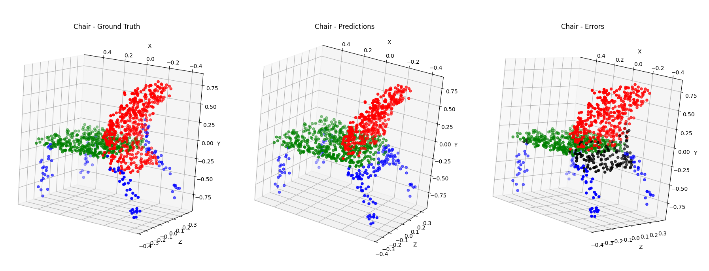
Image of a Chair object

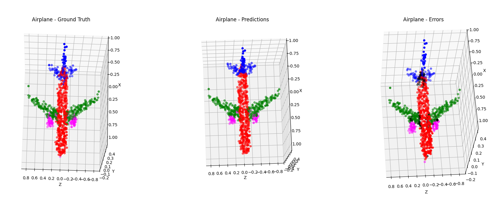
Image of Plane object top view

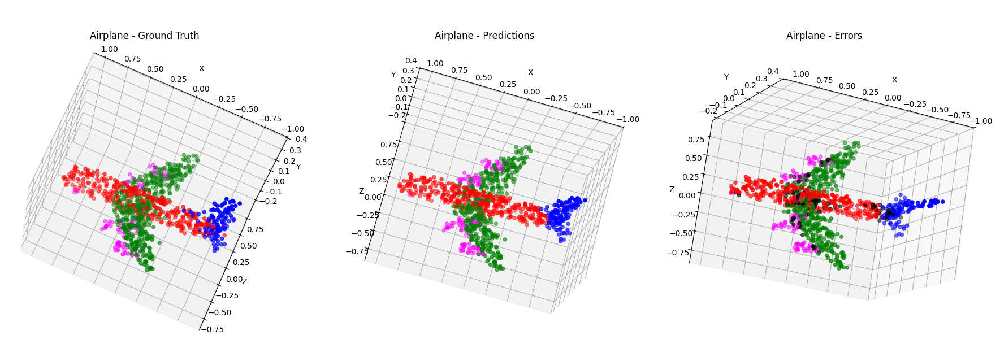
Image of Plane object top-side view

---

### Quantitative Results

In the following figures, the evolution mIoU curves during the training for each object is shown.

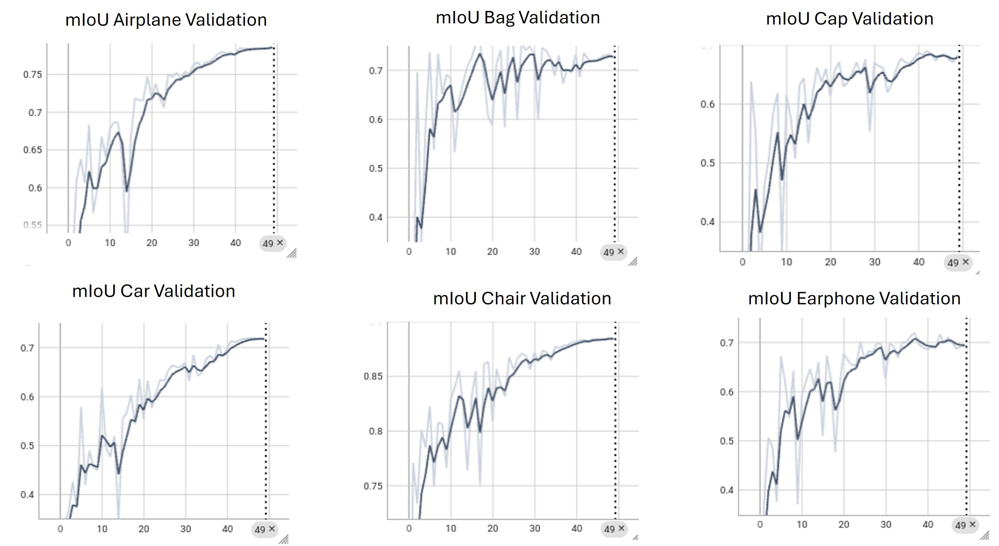
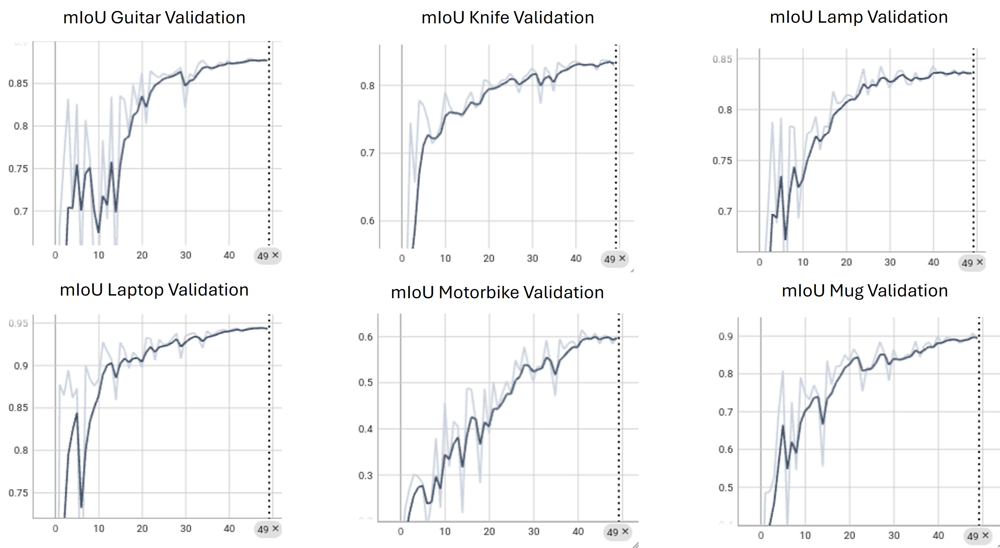
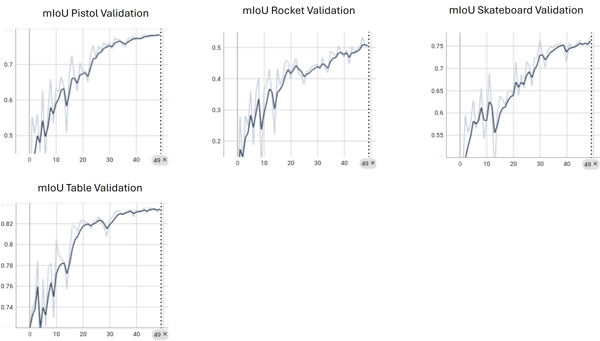

---

### Conclusions

The best results for part segmentation task in ShapeNet dataset has been achieved using the 3rd configuration, PointNet + One-Hot vector + skip connections, the following table shows the comparison of or best results against the original work, for this comparison we are using the result obtained with the test split

|       |  MEAN  |   Air   |   Bag   |   Cap   |   Car   |   Cha   |   Ear   |   Gui   |   Kni   |   Lam   |   Lap   |   Mot   |   Mug   |   Pis   |   Roc   |   Ska   |   Tab   |
|:-----:|:------:|:-------:|:-------:|:-------:|:-------:|:-------:|:-------:|:-------:|:-------:|:-------:|:-------:|:-------:|:-------:|:-------:|:-------:|:-------:|:-------:|
| PointNet  |  83.7  |  83.4  | 78.7                   | 82.5  |  74.9  |  89.6  |  73.0  |  91.5  |  85.9  |  80.8  |  95.3                  |  65.2  |  93.0  |  81.2  |  57.9  |  72.8  |  80.6  |
| OURS      |  78.2  |  80.9  | $\color{green}{79.3}$  |  61.1 |  73.4  |  89.1  |  69.6  |  88.7  |  83.4  |  $\color{green}{83.0}$  |  $\color{green}{95.8}$ |  57.5  |  87.9  |  $\color{green}{81.5}$  |  55.1  |  69.5  |  $\color{green}{85.6}$  |


The mIoU(%) achieved is really close to the original work, we even achieved improved performance on 5 classe, eventought we did really bad performance on others.

With this results we conclude that our implementation of the PointNet architecture is validated.

---

## DALES Dataset

The following section describes the dataset and preprocessing pipeline used for all experiments.

### DALES Dataset Preprocessing

Our primary focus is the real life (not synthetic) DALES (Dayton Annotated Laser Earth Scan) dataset, a collection of 40 aerial LiDAR scans representing complex outdoor scenes and distributed in standard .las format. It consists of forty tiles, each spanning 0.5 km x 0.5 km. Because each DALES scene contains a very large number of points, the raw point clouds are too large to be processed directly by compact deep learning models such as PointNet. A preprocessing step is therefore required to convert each large scene into smaller training samples. 

To make the dataset manageable, each scene is divided into overlapping spatial blocks of 50 m × 50 m using a sliding-window strategy with a 25 m stride. This overlap helps preserve continuity between neighboring regions and reduces the risk of losing important structures at block boundaries. Blocks containing too few points are discarded, while valid blocks are retained for training and evaluation. 

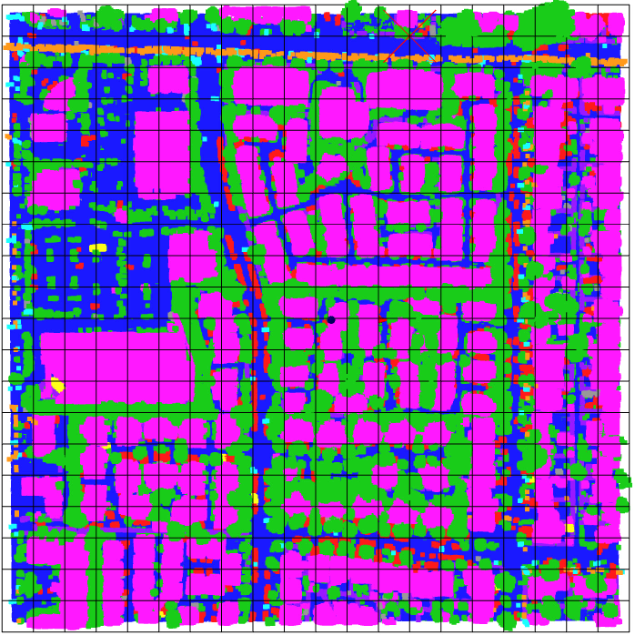

The grid illustrates how large scenes are decomposed into smaller overlapping blocks used as pointnet samples.

After tiling, each block is randomly sampled to a fixed size of 4096 points. This fixed-size representation is necessary because PointNet expects the same number of input points for every training sample. If a block contains more than 4096 points, a subset is sampled without replacement; if it contains fewer points, sampling is performed with replacement. The sampled block is then normalized by centering its XYZ coordinates and scaling them to a unit sphere, which improves numerical stability during training. 

To reduce class imbalance and improve learning stability, the original 7 DALES labels (Ground, Vegetation, Cars, Trucks. Poles, Power lines. Fences and Buildings) are mapped into 5 semantic classes:  0 – Ground, 1 – Vegetation, 2 – Building, 3 – Vehicle, 4 – Utility and  -1 – Ignore. 

This preprocessing pipeline transforms the original large-scale DALES scenes into standardized point-cloud blocks that can be efficiently used for semantic segmentation experiments with PointNet-based architectures. ([`convert_las_to_blocks.py`](./src/convert_las_to_blocks.py)). 

After preprocessing, each point-cloud block is stored in NumPy compressed format (.npz). This choice is motivated by efficiency, simplicity, and compatibility with the training pipeline.

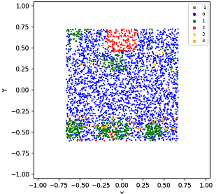

Point cloud block with simplified class labels

The choice of block size (50 m × 50 m) and point count (4096) is driven by a trade-off between geometric context, computational efficiency, and model capacity, particularly for PointNet-based architectures. The block size defines what part of the world the model sees. The point count defines how detailed that view is. A 50 m × 50 m block is large enough to capture both a building and nearby objects such as vehicles, letting the model to learn contextual relationships while preserving local geometric detail. PointNet requires a fixed-size unordered point set, and 4096 is a widely adopted and effective choice.

---

### Geospatial Validation

A key aspect of our workflow is the geospatial validation of DALES samples. Using metadata stored in the .las files (coordinates, projection system), we mapped the dataset into real-world geographic space and visualized it in Google Earth. This allowed us to: verify spatial correctness of the dataset, understand scene context (urban vs rural structures) and validate tiling alignment with real geography.

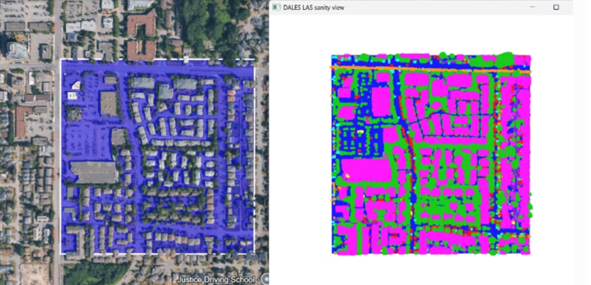


DALES sample tracked down in Google Earth

To validate preprocessing, we implemented visualization tools to visualize the processed point cloud blocks:

Matplotlib 3D visualization: [`viz_blocks_matplotlib.py`](./src/viz_blocks_matplotlib.py)  

Open3D interactive visualization: [`viz_blocks_open3d.py`](./src/viz_blocks_open3d.py)

    These tools allow inspection of spatial structure, verification of class distributions and debugging preprocessing steps


Processed point cloud block


## Optimizer and Learning Rate

For training, we selected standard **Adam** optimizer (`torch.optim.Adam`) initialized with the `learning_rate` from config. By default this is `0.01`.

We also implemented a **cosine annealing** scheduler (`CosineAnnealingLR`) which decays the learning rate from the initial value down to a floor (`scheduler_min_lr`) following a cosine curve over the full training run:

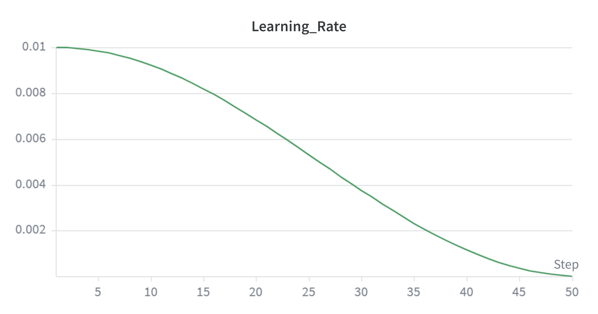

This avoids manually tuning step-decay milestones: the learning rate decreases smoothly to near zero by the final epoch, helping the model settle into a stable minimum.

### Configuration

```yaml
training:
  learning_rate: 0.01          # Initial LR passed to Adam
  scheduler_type: cosine       # Only supported option currently
  scheduler_min_lr: 0.00001    # Floor LR (eta_min in CosineAnnealingLR)
  num_epochs: 50               # Also used as T_max for the scheduler
```

---

## Input Feature Selection

### Hypothesis

PointNet's input is a per-point feature vector. The minimal version uses only XYZ coordinates (3 channels), which captures geometry alone. DALES LiDAR data also provides per-point return metadata: `return_number` (which echo this point came from) and `number_of_returns` (how many echoes the pulse produced). These carry information about vertical structure: a single-return point likely hit a hard surface (ground, rooftop), while a multi-return point passed through vegetation or hit a wire. This signal is complementary to geometry and may help the model distinguish classes that are spatially similar but structurally different, such as low vegetation vs. ground, or utility lines vs. building edges.

The hypothesis is that adding return metadata (XYZ + return_number + number_of_returns, 5 channels) improves segmentation performance, particularly on classes where geometry alone is ambiguous, doing so without meaningful additional compute cost, since PointNet's shared MLP scales with channel count but the increase from 3 to 5 is marginal.

---

### Implementation (`config/default.yaml`)

Feature selection is controlled in the config under `dataset.use_features`. The preprocessing step (`convert_las_to_blocks.py`) extracts all requested features into the NPZ blocks; the dataset loader then selects the subset specified at training time. The number of input channels (`num_channels`) is computed automatically from the selected features.

The input T-Net is hardcoded to operate on XYZ only (`input_dim=3, output_dim=3`), regardless of how many channels the full input has. In the backbone's forward pass, the first three columns (XYZ) are sliced off, transformed by the T-Net, and then concatenated back with any extra channels (e.g., `return_number`, `number_of_returns`) before entering the first shared MLP. This means the spatial transform is applied strictly to geometry, while the return metadata passes through untouched. The first `Conv1d` layer accepts `input_channels` (3 or 5), so `num_channels` is computed automatically from the selected features and no other architecture change is needed.

XYZ-only (3 channels):
```yaml
dataset:
  use_features:
    - xyz
```

XYZ + return data (5 channels):
```yaml
dataset:
  use_features:
    - xyz
    - return_number
    - number_of_returns
```

---

### Experiment Setup

| Run | Input Features | Channels | Purpose |
|---|---|---|---|
| 1 | XYZ | 3 | Geometry-only baseline |
| 2 | XYZ + return_number + number_of_returns | 5 | Geometry + return metadata |

All other hyperparameters are held constant: NLL loss, uniform weights, sampler off, no augmentation, 50 epochs, batch size 32, learning rate 0.01 with cosine annealing.


### Results

| Run | Input Features | mIoU | Buildings | Ground | Utility | Vegetation | Vehicle |
|---|---|:---:|:---:|:---:|:---:|:---:|:---:|
| 1 | XYZ | 0.628 / 0.592 | 0.852 / 0.809 | 0.939 / 0.930 | 0.280 / 0.272 | 0.785 / 0.749 | 0.283 / 0.199 |
| 2 | XYZ + return data | $\color{green}{0.656}$ / $\color{green}{0.637}$ | $\color{green}{0.855}$ / $\color{green}{0.839}$ | $\color{green}{0.937}$ / $\color{green}{0.931}$ | $\color{green}{0.352}$ / $\color{green}{0.344}$ | $\color{green}{0.789}$ / $\color{green}{0.771}$ | $\color{green}{0.345}$ / $\color{green}{0.300}$ |

*Values shown as Train / Val.*

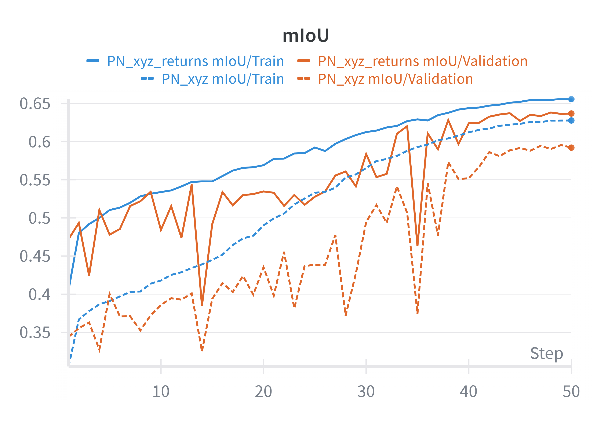


### Conclusions

Adding return metadata (2 extra channels) improves validation mIoU from 0.592 to 0.637 (+0.045), a substantial gain from two extra input features at negligible compute cost. The improvement is driven almost entirely by the rare classes: Utility jumps from 0.272 to 0.344 and Vehicle from 0.199 to 0.300, confirming that return_number and number_of_returns carry discriminative signal about vertical structure that geometry alone cannot capture. Majority classes (Ground, Vegetation, Buildings) remain essentially unchanged, meaning the additional features help where they are needed without hurting elsewhere. All subsequent experiments use the 5-channel input (XYZ + return data).

---

## Class Balancing Strategies

DALES has severe class imbalance: Ground (53% of points), Vegetation (29%), and Buildings (17%) vastly outnumber Vehicle (<1%) and Utility (<1%). This class imbalance can be attacked at three levels: the loss function (how the gradient is shaped), the loss weights (how much each class contributes), and the sampler (which blocks the model trains on). These are not simply additive - they interact, and stacking all three does not guarantee the best result.

The sections below document each strategy independently, the reasoning behind it, and what the results revealed about how they interact.

---

### Focal Loss vs NLL Loss

#### Hypothesis

Standard NLL loss treats every point equally, so the gradient is dominated by abundant, easy-to-classify Ground and Vegetation points. Focal Loss addresses this by applying a scaling factor that dynamically down-weights points the model already classifies confidently, focusing the gradient on hard, ambiguous examples, which tend to be the rare classes.

The expectation is that Focal Loss should improve rare-class IoU compared to NLL under the same weight strategy, at some possible cost to overall IoU on the dominant classes.

#### Implementation (`src/utils/focal_loss.py`)

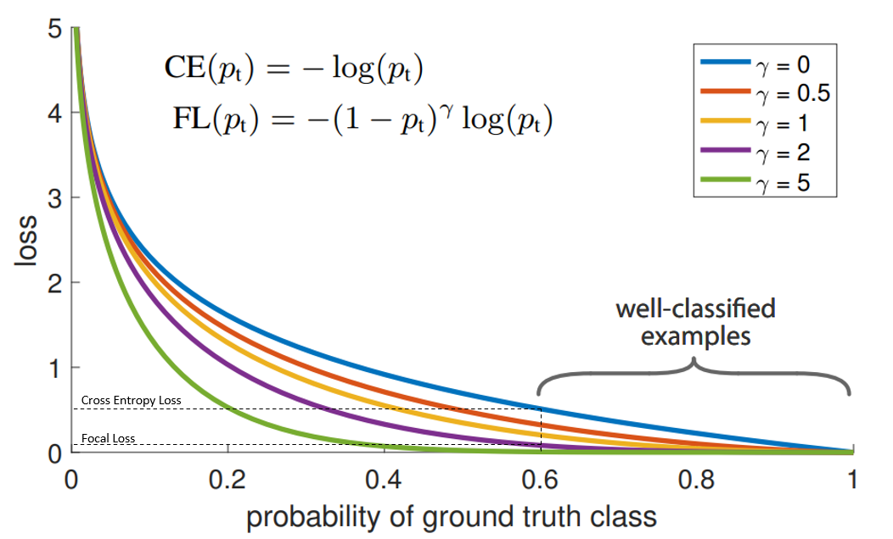

Based on [Lin et al., 2017 — Focal Loss for Dense Object Detection](https://arxiv.org/abs/1708.02002):

$$\text{FL}(p_t) = -\alpha_t \cdot (1 - p_t)^{\gamma} \cdot \log(p_t)$$

| Parameter | Role |
|---|---|
| $\alpha_t$ | Per-class weight (passed as a 5-element tensor). Controls baseline class importance independently of prediction confidence. |
| $\gamma$ | Focusing parameter (default: 1.0). When $\gamma = 0$, reduces to weighted cross-entropy. Higher $\gamma$ suppresses the contribution of easy, confidently classified examples and forces the loss gradient to come from hard misclassifications. |
| `ignore_index=-1` | Points with label `-1` (unknown/unlabeled) are masked out and excluded from loss computation entirely. |


Selected in config with:
```yaml
training:
  loss_function: focal_loss  # alternative: nll_loss
```

---

### Class Weight Strategies

#### Hypothesis

Both Focal Loss and NLL accept a per-class weight vector $\alpha_t$​ that scales each class's contribution to the total loss. An equal-weight vector leaves the frequency imbalance uncorrected at the loss level, while aggressive inverse-frequency weights can destabilize training by amplifying noisy gradients from the small number of rare-class points. The goal is to find the weight vector that maximizes rare-class IoU without degrading performance on the majority classes.

Because the weight vector interacts with the loss function (Focal Loss already down-weights easy examples, so adding aggressive class weights on top may over-correct), the optimal weights may differ between NLL and Focal Loss.

#### Implementation

Both loss functions accept a per-class weight vector $\alpha_t$ that scales each class's contribution to the total loss. We explored several weighting strategies before selecting the Effective Number of Samples (ENS) family for our experiments.

**Class frequencies:**

| Class | Index | Approx. frequency |
|---|---|---|
| Ground | 0 | 53% |
| Vegetation | 1 | 29% |
| Buildings | 2 | 17% |
| Vehicle | 3 | <1% |
| Utility | 4 | <1% |

**Strategies considered:**

1. **Square Root Inverse Frequency (`SQRT_INV_FREQ`)**: $w_c = 1 / \sqrt{f_c}$, then normalized. Mild correction that reduces dominance of common classes without completely suppressing them.

2. **Inverse Frequency (`INV_FREQ`)**: $w_c = 1 / f_c$, normalized. Stronger correction; rare classes receive much higher weights. Risks instability when class imbalance is extreme.

3. **Inverse Frequency Moderate (`INV_FREQ_MODERATE`)**: A capped version of inverse frequency where weights are clipped, preventing extremely small or large weights.

4. **Effective Number of Samples (`ENS_β`)**: Based on [Cui et al., 2019 — Class-Balanced Loss Based on Effective Number of Samples](https://arxiv.org/abs/1901.05555). Weight $= (1 - \beta) / (1 - \beta^{f_c})$. Parameter $\beta$ controls how aggressively rare samples are up-weighted.

**Selected for experiments:** We carried forward only the ENS family with three $\beta$ values: $\beta \in \{0.99999,\ 0.999999,\ 0.9999999\}$. By varying a single parameter, ENS spans the full correction spectrum, from near-uniform (0.99999) through moderate (0.999999) to aggressive (0.9999999), covering the same range as the heuristic strategies above without mixing different weighting philosophies across runs.

| Strategy | Ground | Vegetation | Buildings | Vehicle | Utility |
|---|:---:|:---:|:---:|:---:|:---:|
| ENS 0.99999 | 0.9894 | 0.9894 | 0.9894 | 1.0049 | 1.0270 |
| ENS 0.999999 | 0.5272 | 0.5272 | 0.5276 | 1.5454 | 1.8727 |
| ENS 0.9999999 | 0.0940 | 0.1197 | 0.1633 | 2.0487 | 2.5743 |

Weights can be modified in `config/default.yaml`:
```yaml
loss_weights:
  - 0.9894   # Ground
  - 0.9894   # Vegetation
  - 0.9894   # Buildings
  - 1.0049   # Vehicle
  - 1.0270   # Utility
```

---

### Class Balanced Sampler

#### Hypothesis

Loss weights and Focal Loss both operate at the point level, they reweight individual point contributions within whatever batch the model happens to see. But in DALES, rare classes are spatially concentrated: most blocks contain only Ground, Vegetation, and Buildings, while Vehicle and Utility points appear in a small subset of blocks. Under standard uniform shuffling, the model may go many consecutive batches without encountering a single rare-class point, regardless of how the loss is configured.

The Class Balanced Sampler addresses this at the data-loading level by oversampling blocks that contain at least one rare-class point. This ensures that every batch is likely to include rare-class geometry, providing a consistent gradient signal for those classes throughout training. Unlike loss-level corrections, the sampler changes what the model sees rather than how it scores what it sees.

A key implication is that the sampler may reduce the need for aggressive loss-level rebalancing. If the model already encounters rare-class blocks frequently, the loss function does not need to overcompensate for their absence, uniform weights may suffice because the data distribution itself has been corrected.

#### Implementation (`src/utils/sampler.py`)

The sampler assigns a sampling weight to every block in the training set. For each block, it loads the label array and checks whether any point belongs to a rare class (by default Vehicle and Utility, indices 3 and 4). Blocks containing at least one rare-class point receive a weight of rare_class_boost (default: 3.0); all other blocks receive a weight of 1.0. At each epoch, `torch.multinomial` draws `len(dataset)` indices with replacement according to these weights, so rare-class blocks are approximately 3× more likely to appear than majority-only blocks.

Because sampling is with replacement, some rare-class blocks will appear multiple times per epoch while some majority-only blocks may not appear at all. This is intentional: it trades off slight overfitting risk on rare-class blocks for a substantially more balanced class distribution per epoch.

Selected in config with:

```yaml
training:
  use_sampler: true   # Enable class-balanced sampling
```

When `use_sampler: true`, the DataLoader uses the sampler instead of random shuffling (shuffle and sampler are mutually exclusive in PyTorch). The sampler is applied only to the training set; validation always uses sequential loading.

---

### Experiment Setup

All experiments use the same base configuration: PointNet, Adam optimizer, cosine annealing scheduler (LR 0.01 → 0.00001), batch size 32, 50 epochs, 4096 points per block, XYZ + return data (5 channels). Only the loss function, class weights, and sampler vary across runs (no data augmentation, no dropout).

**Phase 1: Loss function × weight strategy (sampler off)**

| Run | Loss | Weights | Sampler | Purpose |
|---|---|---|---|---|
| 3 | NLL | ENS 0.99999 | Off | NLL with near-uniform weights |
| 4 | NLL | ENS 0.999999 | Off | NLL with moderate correction |
| 5 | NLL | ENS 0.9999999 | Off | NLL with strong correction |
| 6 | Focal (γ=2) | ENS 0.99999 | Off | Focal γ=2 with near-uniform weights |
| 7 | Focal (γ=2) | ENS 0.999999 | Off | Focal γ=2 with moderate correction |
| 8 | Focal (γ=1) | ENS 0.99999 | Off | Focal γ=1 with near-uniform weights |
| 9 | Focal (γ=1) | ENS 0.999999 | Off | Focal γ=1 with moderate correction |
| 10 | Focal (γ=1) | ENS 0.9999999 | Off | Focal γ=1 with strong correction |

**Phase 2: Adding the class-balanced sampler**

| Run | Loss | Weights | Sampler | Purpose |
|---|---|---|---|---|
| 11 | NLL | Uniform | On (3×) | Sampler + NLL uniform weights |
| 12 | NLL | ENS 0.999999 | On (3×) | Sampler + NLL moderate weights |
| 13 | Focal (γ=1) | Uniform | On (3×) | Sampler + Focal γ=1 uniform weights |

**Note on Phase 2 weight choices:** Phase 2 includes runs with Uniform weights (Runs 11 and 13) alongside the moderate ENS 0.999999 (Run 12) intentionally. As mentioned above, the hypothesis is that the class-balanced sampler and loss-level weight correction may compete rather than complement each other: the sampler already corrects the class distribution at the data level, so adding aggressive loss weights on top could over-correct and destabilize training. By testing Uniform weights with the sampler on, we can isolate the sampler's contribution and determine whether loss-level rebalancing is still necessary once the model sees rare-class blocks frequently.

---

### Results

**Phase 1: Loss function × weight strategy (sampler off)**

| Run | Loss | Weights | mIoU | Buildings | Ground | Utility | Vegetation | Vehicle |
|---|---|---|:---:|:---:|:---:|:---:|:---:|:---:|
| 3 | NLL | ENS 0.99999 | 0.651 / 0.630 | 0.846 / 0.828 | 0.937 / 0.929 | 0.350 / 0.344 | 0.784 / 0.766 | 0.340 / 0.285 |
| 4 | NLL | ENS 0.999999 | $\color{green}{0.671}$ / $\color{green}{0.641}$ | 0.851 / 0.834 | $\color{green}{0.938}$ / $\color{green}{0.930}$ | $\color{green}{0.391}$ / $\color{green}{0.357}$ | 0.781 / 0.763 | $\color{green}{0.394}$ / $\color{green}{0.322}$ |
| 5 | NLL | ENS 0.9999999 | 0.598 / 0.576 | 0.826 / 0.814 | 0.928 / 0.922 | 0.238 / 0.214 | 0.725 / 0.711 | 0.271 / 0.220 |
| 6 | Focal (γ=2) | ENS 0.99999 | 0.642 / 0.621 | 0.839 / 0.825 | 0.932 / 0.924 | 0.332 / 0.321 | 0.772 / 0.756 | 0.337 / 0.279 |
| 7 | Focal (γ=2) | ENS 0.999999 | 0.648 / 0.622 | 0.827 / 0.816 | 0.931 / 0.924 | 0.361 / 0.335 | 0.757 / 0.743 | 0.366 / 0.290 |
| 8 | Focal (γ=1) | ENS 0.99999 | 0.661 / 0.639 | $\color{green}{0.852}$ / $\color{green}{0.837}$ | 0.937 / 0.930 | 0.365 / 0.357 | $\color{green}{0.786}$ / $\color{green}{0.769}$ | 0.366 / 0.303 |
| 9 | Focal (γ=1) | ENS 0.999999 | 0.659 / 0.630 | 0.836 / 0.822 | 0.934 / 0.927 | 0.378 / 0.350 | 0.767 / 0.750 | 0.379 / 0.303 |
| 10 | Focal (γ=1) | ENS 0.9999999 | 0.586 / 0.566 | 0.816 / 0.808 | 0.924 / 0.919 | 0.222 / 0.199 | 0.715 / 0.703 | 0.251 / 0.203 |

*Values shown as Train / Val.*

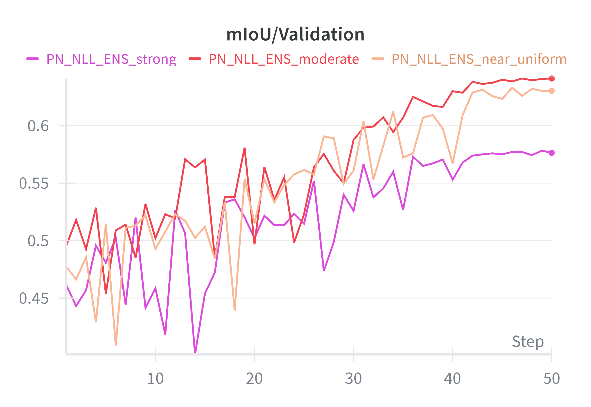
*Validation mIoU for NLL loss across weight strategies (sampler off).*

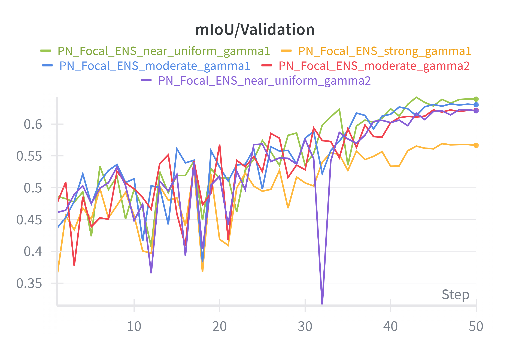
*Validation mIoU for Focal loss across weight strategies and gamma settings (sampler off).*

**Phase 2: Adding the class-balanced sampler**

| Run | Loss | Weights | Sampler | mIoU | Buildings | Ground | Utility | Vegetation | Vehicle |
|---|---|---|---|:---:|:---:|:---:|:---:|:---:|:---:|
| 11 | NLL | Uniform | On (3×) | 0.664 / 0.639 | $\color{green}{0.857}$ / $\color{green}{0.842}$ | 0.942 / 0.930 | 0.372 / 0.352 | $\color{green}{0.783}$ / $\color{green}{0.772}$ | 0.365 / 0.302 |
| 12 | NLL | ENS 0.999999 | On (3×) | $\color{green}{0.680}$ / $\color{green}{0.646}$ | 0.857 / 0.836 | $\color{green}{0.943}$ / $\color{green}{0.930}$ | $\color{green}{0.409}$ / $\color{green}{0.365}$ | 0.777 / 0.767 | $\color{green}{0.416}$ / $\color{green}{0.330}$ |
| 13 | Focal (γ=1) | Uniform | On (3×) | 0.652 / 0.628 | 0.840 / 0.829 | 0.939 / 0.927 | 0.362 / 0.348 | 0.768 / 0.761 | 0.352 / 0.275 |

*Values shown as Train / Val.*

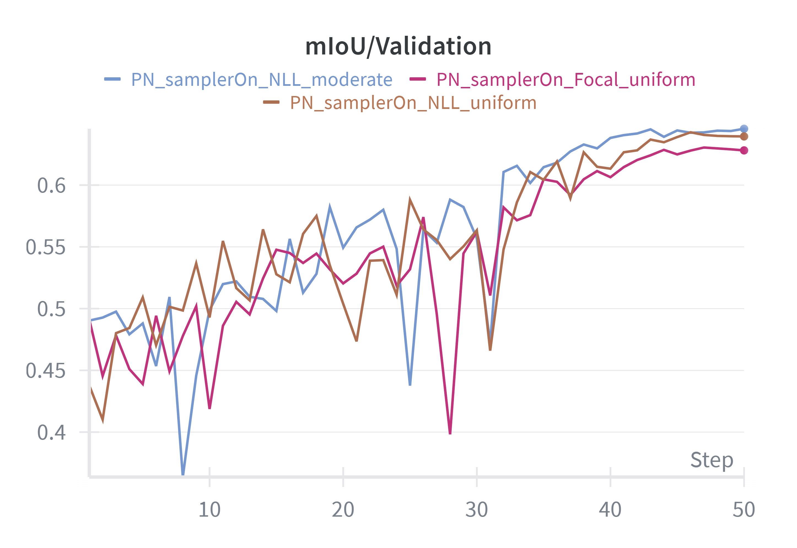
*Validation mIoU for across loss x weight strategies with sampler on.*

---

### Conclusions

**NLL consistently outperforms Focal Loss.** Under matched weight strategies, NLL achieves higher validation mIoU than both Focal γ=2 and Focal γ=1. The best Phase 1 result is NLL + ENS 0.999999 (Run 4, val mIoU 0.641), compared to the best Focal result of 0.639 (Run 8, Focal γ=1 + ENS 0.99999). Focal γ=2 performs worst among the loss functions, suggesting that aggressive down-weighting of easy examples hurts more than it helps when the model still needs strong gradients from majority classes for spatial context. Focal γ=1 is a milder variant and comes closer to NLL, but does not surpass it.

**Moderate ENS weights (β = 0.999999) are the sweet spot.** Across both NLL and Focal Loss, ENS 0.999999 delivers the best rare-class IoU without degrading majority classes. Near-uniform weights (ENS 0.99999) underperform because they leave the imbalance essentially uncorrected at the loss level. Strong weights (ENS 0.9999999) collapse performance, with mIoU dropping to 0.576 (NLL) and 0.566 (Focal γ=1) (the extreme weight ratio destabilizes training).

**The class-balanced sampler provides an additive boost with NLL.** Run 12 (NLL + ENS 0.999999 + sampler) achieves the highest overall validation mIoU of 0.646 and the best Utility and Vehicle IoU (0.365 and 0.330 accordingly). The sampler ensures rare-class blocks appear consistently, so the loss-level moderate weights and sampler-level oversampling complement each other. However, stacking the sampler with Focal Loss (Run 13) does not help: validation mIoU drops to 0.628, confirming that Focal's dynamic down-weighting conflicts with the sampler's data-level correction.

**Best configuration:** NLL + ENS 0.999999 + class-balanced sampler (Run 12). Utility and Vehicle remain the hardest classes, but this is the best result achieved across all balancing experiments.

---

## Data Augmentation

### Hypothesis

Aerial LiDAR scans are captured from above, so the same object (house, tree, car) can appear at any horizontal rotation depending on the flight path. Without augmentation, the model may learn orientation-specific patterns instead of actual shape.


### Implementation (`src/models/dataset.py`)

Augmentation is applied only at training time (disabled for validation and test splits). It is implemented in `src/utils/dataset.py` and controlled through `config/default.yaml`:

```yaml
dataset:
  augmentation: true
  rotation_deg_max: 180.0    # Uniform sample from [-180°, +180°]
```

The following transform is applied per sample:

- **Random Z-axis rotation**: a rotation angle $\theta \sim \mathcal{U}(-180°, +180°)$ is sampled and applied to the XYZ coordinates only. Return number, and number-of-returns channels are unaffected.


### Experiment Setup

To isolate the effect of data augmentation, we compare the best configuration from the Class Balancing experiments (Run 12: NLL + ENS 0.999999 + sampler) with and without augmentation enabled. All other hyperparameters are held constant.

| Run | Augmentation | Loss | Weights | Sampler | Purpose |
|---|---|---|---|---|---|
| 12 | Off | NLL | ENS 0.999999 | On (3×) | Baseline (best balancing config) |
| 15 | On | NLL | ENS 0.999999 | On (3×) | Add random Z-axis rotation |


### Results

| Run | Augmentation | mIoU | Buildings | Ground | Utility | Vegetation | Vehicle |
|---|---|:---:|:---:|:---:|:---:|:---:|:---:|
| 12 | Off | $\color{green}{0.680}$ / $\color{green}{0.646}$ | $\color{green}{0.857}$ / $\color{green}{0.836}$ | $\color{green}{0.943}$ / $\color{green}{0.930}$ | $\color{green}{0.409}$ / $\color{green}{0.365}$ | $\color{green}{0.777}$ / $\color{green}{0.767}$ | $\color{green}{0.416}$ / $\color{green}{0.330}$ |
| 15 | On | 0.638 / 0.636 | 0.822 / 0.829 | 0.934 / 0.927 | 0.357 / 0.353 | 0.745 / 0.755 | 0.332 / 0.313 |

*Values shown as Train / Val.*

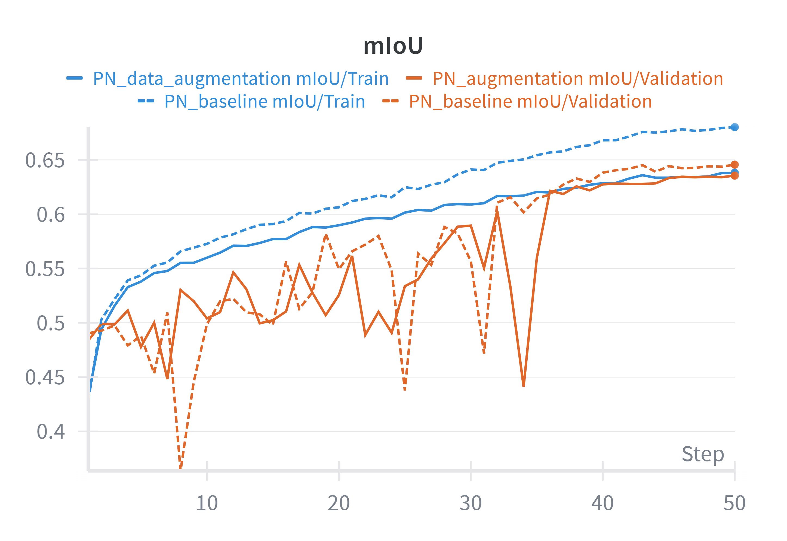

### Conclusions

Data augmentation narrows the train–val gap substantially (from 0.034 to 0.002 in mIoU), confirming that it acts as an effective regularizer and reduces overfitting. Validation mIoU drops slightly compared to the non-augmented baseline (0.636 vs. 0.646), but the near-complete elimination of the generalization gap is a positive signal: the model is no longer memorizing training blocks. This trade-off (lower peak performance but more honest generalization) is typical when adding regularization to a model that was previously overfitting. We carry augmentation forward to the dropout experiments, expecting that dropout can recover the lost capacity while preserving the tighter train–val alignment that augmentation provides.

---

## Dropout

### Hypothesis

The original PointNet paper does not use dropout in the segmentation head. However, our setting differs from the original in two ways: we operate on small fixed-size blocks (4096 points) rather than full scenes, and the DALES training set contains a limited number of such blocks. This means the model sees the same local geometries repeatedly across epochs, which creates a risk of overfitting to block-specific patterns rather than learning generalizable per-point features. The hypothesis is that adding moderate dropout (0.3-0.5) before the final classification layer will act as a complementary regularizer to data augmentation: while augmentation diversifies the input geometry, dropout prevents the segmentation head from relying on fixed activation patterns, encouraging more robust internal representations.


### Implementation

Dropout is applied in the segmentation head after the last shared MLP layer (`128 → 128`, with batch norm and ReLU), immediately before the final `Conv1d` projection to `num_classes`. 

The dropout rate is controlled via config and CLI:

```yaml
training:
  dropout_rate: 0.3   # 0 = no dropout (paper default)
```

When `dropout_rate: 0`, the model matches the original PointNet paper behavior.

### Experiment Setup

Starting from the best balancing configuration with augmentation enabled (Run 15: NLL + ENS 0.999999 + sampler + augmentation), we test two dropout rates. All other hyperparameters are held constant.

| Run | Dropout | Augmentation | Loss | Weights | Sampler | Purpose |
|---|---|---|---|---|---|---|
| 15 | 0.0 | On | NLL | ENS 0.999999 | On (3×) | Baseline (augmentation, no dropout) |
| 16 | 0.3 | On | NLL | ENS 0.999999 | On (3×) | Moderate dropout |
| 17 | 0.5 | On | NLL | ENS 0.999999 | On (3×) | Stronger dropout |

### Results

| Run | Dropout | mIoU | Buildings | Ground | Utility | Vegetation | Vehicle |
|---|---|:---:|:---:|:---:|:---:|:---:|:---:|
| 15 | 0.0 | 0.638 / 0.636 | 0.822 / 0.829 | 0.934 / 0.927 | 0.357 / 0.353 | 0.745 / 0.755 | 0.332 / 0.313 |
| 16 | 0.3 | $\color{green}{0.664}$ / $\color{green}{0.660}$ | $\color{green}{0.850}$ / $\color{green}{0.852}$ | 0.940 / 0.932 | $\color{green}{0.386}$ / $\color{green}{0.378}$ | $\color{green}{0.769}$ / $\color{green}{0.779}$ | $\color{green}{0.375}$ / $\color{green}{0.359}$ |
| 17 | 0.5 | 0.662 / 0.658 | 0.848 / 0.851 | $\color{green}{0.940}$ / $\color{green}{0.933}$ | 0.385 / 0.377 | 0.766 / 0.776 | 0.371 / 0.355 |

*Values shown as Train / Val.*

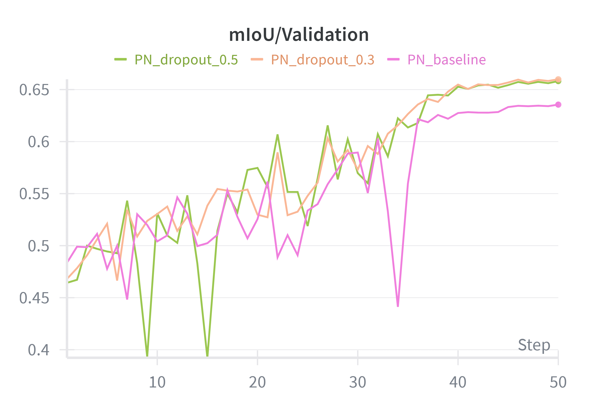

### Conclusions

Dropout provides a clear improvement over the no-dropout augmentation baseline. At dropout 0.3 (Run 16), validation mIoU rises from 0.636 to 0.660 (+0.024), with gains across all five classes. The train–val gap remains very small (0.004), confirming that dropout and augmentation together produce strong regularization. Vehicle shows the largest relative improvement (val IoU 0.313 → 0.359), suggesting that dropout helps the model generalize better on rare classes by preventing the segmentation head from overfitting to the small set of rare-class blocks seen during training.

Dropout 0.5 (Run 17) performs nearly identically to 0.3 (val mIoU 0.658 vs. 0.660), indicating that the model is not very sensitive to the exact rate in this range. The marginal drop at 0.5 suggests that stronger dropout starts to under-fit slightly, but the difference is within noise.

---

## PointNet on DALES - Incremental Improvements (Validation)

Each row adds one technique on top of the previous best. The Gap column shows train mIoU − validation mIoU (lower = better generalization).

| Technique | mIoU | Gap | Ground | Vegetation | Buildings | Vehicle | Utility |
|---|:---:|:---:|:---:|:---:|:---:|:---:|:---:|
| **Baseline (XYZ only)** | 0.592 | 0.036 | 0.930 | 0.749 | 0.809 | 0.199 | 0.272 |
| **+ Input features** | 0.637 ($\color{green}{+0.045}$) | 0.019 | 0.931 ($\color{green}{+0.001}$) | 0.771 ($\color{green}{+0.022}$) | 0.839 ($\color{green}{+0.030}$) | 0.300 ($\color{green}{+0.101}$) | 0.344 ($\color{green}{+0.072}$) |
| **+ Class balancing** | 0.646 ($\color{green}{+0.009}$) | 0.034 | 0.930 ($\color{red}{−0.001}$) | 0.767 ($\color{red}{−0.004}$) | 0.836 ($\color{red}{−0.003}$) | 0.330 ($\color{green}{+0.030}$) | 0.365 ($\color{green}{+0.021}$) |
| **+ Data augmentation** | 0.636 ($\color{red}{−0.010}$) | 0.002 ($\color{green}{-0.032}$) | 0.927 ($\color{red}{−0.003}$) | 0.755 ($\color{red}{−0.012}$) | 0.829 ($\color{red}{−0.007}$) | 0.313 ($\color{red}{−0.017}$) | 0.353 ($\color{red}{−0.012}$) |
| **+ Dropout (0.3)** | 0.660 ($\color{green}{+0.024}$) | 0.004 | 0.932 ($\color{green}{+0.005}$) | 0.779 ($\color{green}{+0.024}$) | 0.852 ($\color{green}{+0.023}$) | 0.359 ($\color{green}{+0.046}$) | 0.378 ($\color{green}{+0.025}$) |

<!-- $\color{green}{+0.025}$ -->
<!-- $\color{red}{−0.012}$ -->

*Cumulative improvement from baseline to best: **+0.068 mIoU** (0.592 → 0.660). Largest per-class gain: Vehicle +0.160, Utility +0.106.*

***Best overall configuration:** NLL + ENS 0.999999 + class-balanced sampler + augmentation + dropout 0.3 (Run 16).*

---

## IPointNet: BEV-Point Cloud Fusion

We now extend the baseline PointNet architecture by incorporating BEV-based spatial context through the proposed IPointNet model.

In this work, we extend the PointNet architecture by integrating Bird’s Eye View (BEV) representations with 3D point clouds to improve semantic segmentation performance on the DALES dataset. While PointNet learns directly from unordered point sets, it has limited ability to capture larger spatial context. To overcome this limitation, we introduce a multi-modal pipeline that combines local 3D geometry with 2D spatial context derived from BEV images.

---

### Full-Density BEV Generation

We generate dense BEV raster images directly from the raw .las files, without any PointNet subsampling. The same 50 m × 50 m sliding windows used for point-cloud blocks are applied to create perfectly aligned BEV tiles.

Each BEV image has a resolution of 256 × 256 pixels and contains four channels:

Density (log(1 + number of points))
Z max (maximum elevation)
Z mean (average elevation)
Z range (height variation)

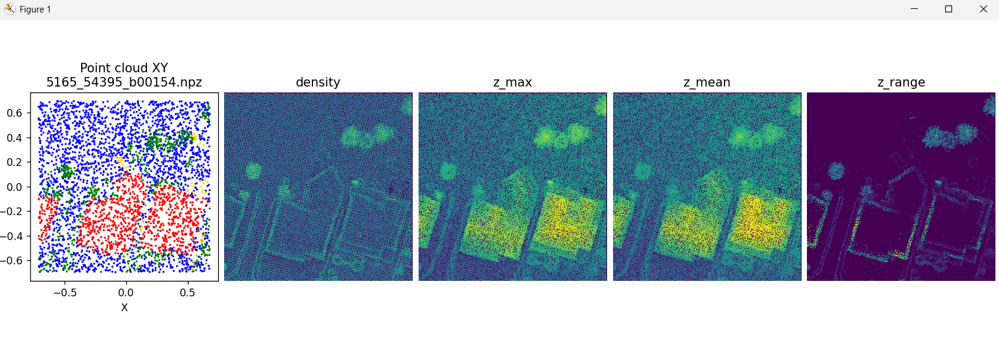
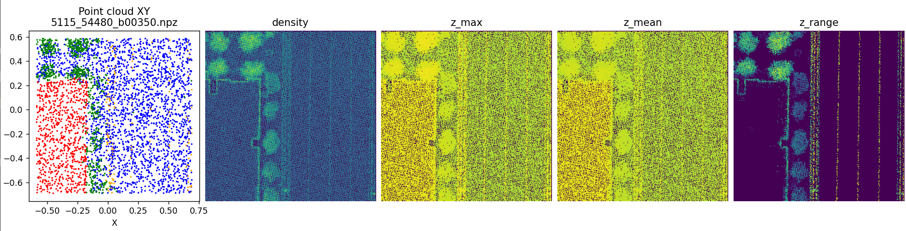
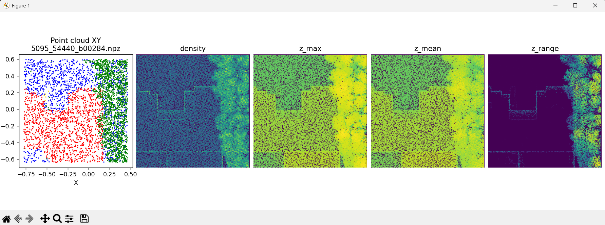
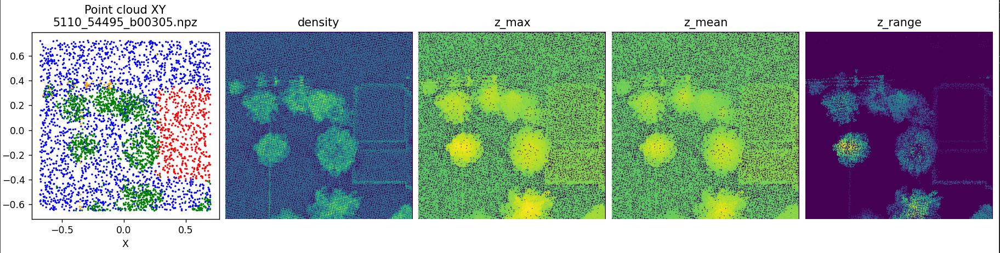


Full-density BEV representation showing density and height statistics

This representation preserves global spatial structure and captures geometric properties that are not directly accessible from local point neighborhoods. The BEV images are stored as compressed NumPy files (.npz) for efficient loading and training. ([`generate_full_density_bev_rasters_from_las.py`](./src/generate_full_density_bev_rasters_from_las.py))

---

### Point Cloud and BEV Alignment

A key contribution of this work is the precise alignment between point-cloud blocks and BEV images. During preprocessing, each point-cloud block stores metadata that allows deterministic matching with its corresponding BEV tile.

In addition to the standard PointNet preprocessing, we store:

Block origin (x0, y0)
Tile indices (tile_ix, tile_iy)
BEV filename for direct lookup
Per-point XY coordinates in BEV space (xy_grid)

The xy_grid encodes the position of each point inside the BEV tile using normalized coordinates in the range [-1, 1]. This enables exact spatial correspondence between the 3D point cloud and the 2D BEV representation.

([`convert_las_to_blocks.py`](./src/convert_las_to_blocks.py))

---

### Image Encoder and Initial Global Fusion

Initially, we used a convolutional image encoder to extract a global feature vector (fvect) from the BEV image. This encoder progressively reduces spatial resolution through convolution and pooling layers, followed by global average pooling.

The resulting vector summarizes the entire BEV tile into a single descriptor. This vector was then broadcast and concatenated to all points in the block.

However, this approach did not improve performance. The reason is that global pooling removes all spatial information, meaning that every point receives identical BEV context regardless of its location.

---

### Local BEV Feature Fusion

To address this limitation, we implemented a local fusion strategy that preserves spatial alignment at the point level.

Instead of using the global feature vector, we use the spatial feature map produced by the image encoder ([`img_encoder.py`](./src/img_encoder.py)). This feature map preserves spatial information and provides per-point feature extraction through interpolation.

This operation assigns each point a BEV feature that represents its local neighborhood:

Points in dense regions receive high-density features
Points on buildings capture height structure
Points near utilities capture vertical variation patterns

This local sampling is implemented using PyTorch’s grid_sample operation inside the IPointNet architecture.

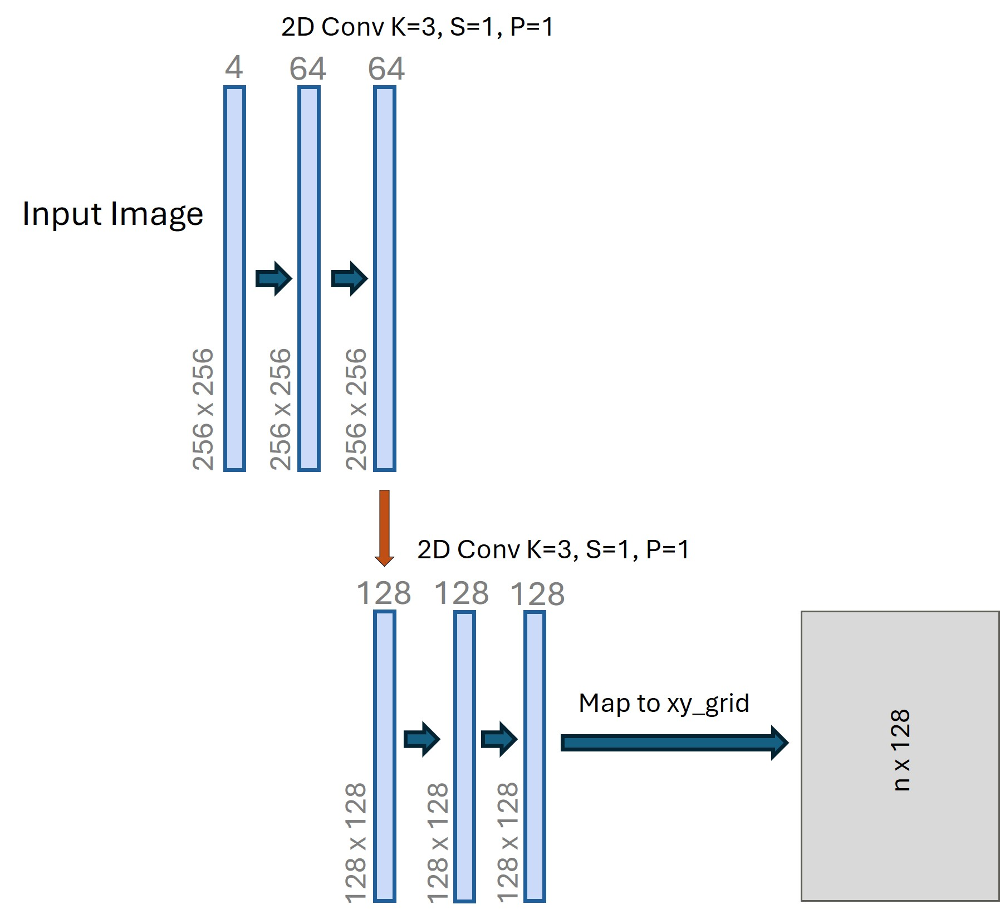

---

### Implicit BEV Neighborhood

The BEV neighborhood is not explicitly defined by a radius. Instead, it emerges from:

The BEV resolution (≈ 0.2 m per pixel)
The receptive field of the convolutional encoder

As a result, each point receives contextual information corresponding to approximately 2–3 meters around its location. This provides mid-scale spatial context that complements the fine-grained geometry captured by PointNet.

---

### IPointNet Architecture

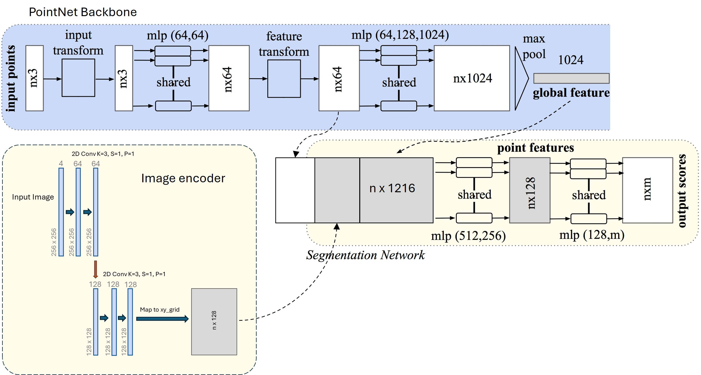

The final IPointNet model extends the standard PointNet segmentation pipeline by incorporating BEV features.
The implementation of both PointNet and IPointNet architectures can be found in [`pointnet.py`](./src/models/pointnet.py), specifically in the `IPointNetSegmentation` class.

For each point, the model concatenates:

Local PointNet features
Global PointNet feature
Locally sampled BEV feature

These combined features are processed through shared multilayer perceptrons to predict semantic labels.

---

### Results

The integration of BEV features leads to a significant improvement in segmentation performance.

|   | mIoU | Ground | Vegetation | Buildings | Vehicle | Utility |
|---|:---:|:---:|:---:|:---:|:---:|:---:|
| **PointNet** | 0.66 | 0.95  | 0.79 | 0.86 | 0.36 | 0.33 |
| **IPointNet** | $\color{green}{0.76}$ | 0.95 | $\color{green}{0.86}$ | $\color{green}{0.92}$ | $\color{green}{0.55}$ | $\color{green}{0.52}$ |

PointNet baseline: 0.66 mIoU  
IPointNet: 0.77 mIoU  

This corresponds to:

+0.11 absolute mIoU improvement  
~17% relative improvement  

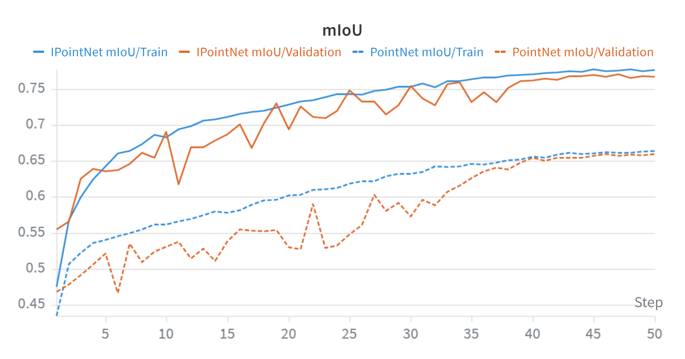
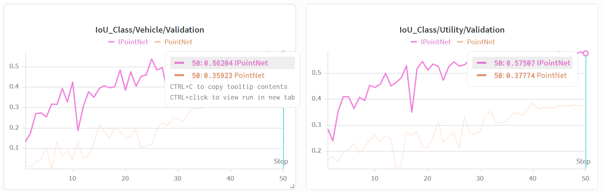


Training and validation curves showing stable convergence

At the class level, the most significant gains are observed in:

Vehicles: +20 IoU  
Utility structures (poles, power lines, fences): +20 IoU  

These classes benefit strongly from spatial context such as density patterns and height variation.

---

### Key Insight

The main finding of this work is that BEV fusion is only effective when spatial alignment is preserved at the point level.

Global fusion (single vector per image) does not provide useful information for segmentation. In contrast, local feature sampling allows each point to access context from its own spatial neighborhood, leading to substantial performance gains.

---

### Conclusion

IPointNet demonstrates that combining 3D point-based learning with 2D BEV representations significantly improves semantic segmentation of aerial LiDAR data. The key enabler is the preservation of spatial correspondence between modalities and the use of local feature fusion.

Future work may explore multi-scale BEV representations, attention-based fusion mechanisms, and integration with more advanced point-cloud architectures such as PointNet++.

---

## PointNet++

PointNet++ is a deep neural network designed to process unordered point sets sampled from a metric space. The architecture extends the original PointNet by introducing a hierarchical feature learning framework that captures both local geometric structures and global contextual information.

While PointNet processes the entire point cloud using a single global aggregation, PointNet++ organizes the computation into multiple levels of abstraction, progressively learning features from small local neighborhoods to larger spatial regions. This hierarchical structure enables the network to capture fine-grained geometric patterns and improves performance on complex scenes and segmentation tasks.

The architecture consists of two main components:

- Encoder (Set Abstraction layers, SA) – extracts hierarchical features from the input point cloud.
- Decoder (Feature Propagation layers, FP) – propagates the learned features back to the original points for dense prediction tasks such as semantic segmentation.

Next Figure shows the PointNet++ architecture 

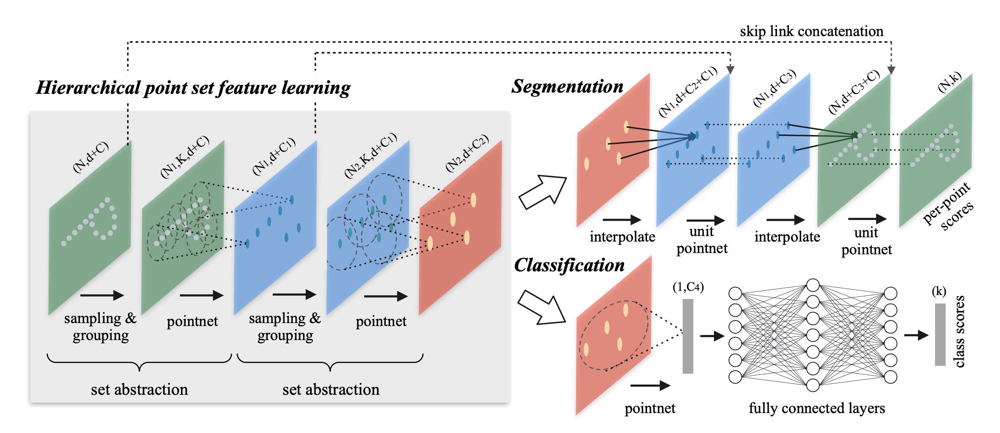
(from "PointNet++: Deep Hierarchical Feature Learning on Point Sets in a Metric Space" (Qi et al., 2017).)


---

### Encoder
The encoder builds a hierarchical representation of the point cloud through successive **Set Abstraction (SA)** layers. Each SA layer applies sequentially:

1. **Farthest Point Sampling (FPS)** to select a subset of centers  
2. **Neighborhood grouping** around each center  
3. A **shared MLP + max pooling** to extract local geometric features  (mini PointNet)

As the network progresses towards deeper layers, the number of centers decreases and the distance between them increases. Therefore, even if the number of neighbors remains constant, the spatial extent of each neighborhood (effective receptive field) naturally grows with depth, allowing each layer to capture geometric structures at a different spatial scale. Early layers focus on **small local structures (fine geometric structures)**, while deeper layers represent **larger semantic structures** describing the scene.

#### 1. Farthest Point Sampling (FPS)

In order to select the center points, PointNet++ uses Farthest Point Sampling (FPS). It iteratively selects points that maximize the distance from previously selected centers. This ensures that the sampled points are evenly distributed across the point cloud.


#### 2. Neighborhood Grouping

The grouping stage constructs local neighbourhoods around each center. The strategy used to select neighbors determines the **spatial support of the local patch**, which directly influences the type of geometric structures the network can capture. Two grouping strategies are compared:

- **k-Nearest Neighbors**: selects the K closest points
- **Radius-Based grouping**: selects all points within a predefined radius


**k-Nearest Neighbors** (`knn`)

In knn grouping, for each center point the K nearest points in Euclidean space are selected. Consequently:
- **Number of neighbors** is fixed
- **Spatial size of the neighborhood** depends on the local point density. 

In dense regions, the K nearest neighbors lie close to the center and define a small spatial patch, whereas in sparse regions, the same number of neighbors may lie further defining a much larger spatial area. As a result, the **effective receptive field** varies with point density.

**Radius-Based Grouping**

The idea behind Radius-Based grouping is to reduce the density dependency. To do so, neighbors are selected within a **fixed spatial radius** around each center. Consequently:
- **Maximum spatial support of the neigborhood** is fixed for each layer
- **Number of neighbors** depends on the local point density

However, PointNet++ expects a fixed number of neighbours. If the ball contains less than K points, some points are repeated (note that this repetition does not bias information towards repeated points since in FP layers we deliberately apply max-pooling to extract features instead of average-pooling). On the contrary, if the ball contains more than K points, only up to K are retained. As a consequence, the **effective receptive field** may still depend on how those neighbors are selected, especially in dense regions where more than K points may lie inside the ball. Two strategies were implemented to select these K neighbors.

- `ball_closest`: When more than K points lie inside the radius, only the **K closest points to the center** are selected.

    Although the neighborhood is bounded by the radius, this selection strategy introduces a bias toward points located near the center. 
    As a consequence, the **effective receptive field** may shrink in dense regions introducing a **mild density dependence**

- `ball_random`: When more than K points lie inside the radius, **K of them are randomly sampled**.

    In this case, the radius effctively defines the spatial extent of the neighborhood, since any point within the ball has an equal probability of being selected. As a consequence, the **effective receptive field** closely matches the radius making the strategy largely **density independent**


The following comparison highlights how the choice of grouping strategy controls the spatial scale of the features learned by PointNet++, and therefore influences the types of geometric structures that can be captured at different levels of the network hierarchy.


| Method        | Spatial Support | Effective Receptive Field        | Density Sensitivity |
|---------------|-----------------|-----------------------------------|---------------------|
| **knn**       | Variable (no limit)      | Variable                          | High                |
| **ball_closest** |Fixed (radius cap)      | May shrink in dense regions (center-biased sampling)      | Moderate            |
| **ball_random**  | Fixed (radius cap)    | Tends to span the ball (random sampling)     | Lower               |


#### 3. A Shared MLP + Max Pooling

After selecting the K neighbors for each center, each local region is processed by a mini-PointNet network, which learns a feature representation for the neighborhood. This consists of a shared multilayer perceptron (MLP) applied independently to each point followed by a symmetric aggregation function (max pooling) to obtain a single feature vector representing the region.

---

### Decoder

While the encoder progressively reduces the number of points and extracts higher-level features, semantic segmentation requires a prediction for **every original input point**. Therefore, PointNet++ includes a decoder composed of successive **Feature Propagation (FP)** layers, which progressively upsample features from sparse point sets back to denser ones. Each Feature Propagation layer applies sequentially:

1. **3-NN interpolation** to transfer features from a sparse set of points to a denser one  
2. **Concatenation with skip features** coming from the encoder  
3. A **shared MLP** to refine the propagated features  

In this way, the decoder combines high-level semantic information from deeper layers with fine geometric details preserved by the early encoder layers.


#### 1. 3-NN Interpolation

At each decoder stage, features from a sparse set of points are interpolated onto a denser set of target points. For each target point, the three nearest source points are identified and their features are interpolated using weights inversely proportional to their distance. Therefore, closer source points contribute more strongly to the interpolated feature, while farther ones contribute less.

This interpolation step allows features learned at coarse spatial resolutions to be transferred back to denser point sets.

#### 2. Concatenation with Skip Features

After interpolation, the propagated features are concatenated with the corresponding **skip features** coming from the encoder.

These skip features provide local geometric information extracted at earlier abstraction levels, where the point resolution is still relatively high. Consequently, the decoder does not rely only on coarse semantic information from deep layers, but also reuses fine-grained spatial details that may have been lost during downsampling.

#### 3. Shared MLP Refinement

Once the interpolated features and skip features have been concatenated, the resulting feature vectors are refined using a **shared multilayer perceptron (MLP)** applied independently to each point. In doing so, semantic information coming from the decoder and geometric details preserved from the skip connections are fused together, producing a more informative point-wise representation

By stacking several Feature Propagation layers, the decoder progressively reconstructs point features at increasing resolutions until features are available for the full original point cloud size.

---

### Network Architecture 


#### Encoder Architecture (SA Layers)

| Layer | # Centers (FPS) | Neighborhood | K | Radius | MLP |
|:------:|:-----------------:|:-------------:|:---:|:-------:|:------|
| **SA1** | 1024 | knn / ball query | 32 | 0.08 | `[32,32,64]` |
| **SA2** | 256 | knn / ball query | 32 | 0.10 | `[64,64,128]` |
| **SA3** | 64 | knn / ball query | 32 | 0.20 | `[128,128,256]` |
| **SA4** | 16 | knn / ball query | 32 | 0.40 | `[256,256,512]` |

**Tensor Shapes**

Each Set Abstraction (SA) layer samples centers using FPS, groups K neighbors around each center, applies a shared MLP to the grouped features, and aggregates the neighborhood using max pooling.

| Layer | Input<br>(xyz / features)  |  Grouped neighbors | After shared MLP | After max pooling | Output<br>(xyz / features) |
|:------:|:--------------------------|:------------------|:-----------------|:------------------|:------------------------|
| **SA** (generic) | `[B,N,3]`/`[B,N,C]`  | `[B,S,K,3+C]`      |    `[B,C_out,S,K]`  |     `[B,C_out,S]`    | `[B,S,3]`/`[B,S,C_out]` |                       
| **SA1** | `[B,N,3]`/<br>`None`           | `[B,1024,32,3]` | `[B,64,1024,32]` | `[B,64,1024]` | `[B,1024,3]`/<br>`[B,1024,64]` |
| **SA2** | `[B,1024,3]`/<br>`[B,1024,64]` | `[B,256,32,67]` | `[B,128,256,32]` | `[B,128,256]` | `[B,256,3]`/<br>`[B,256,128]` |
| **SA3** | `[B,256,3]`/<br>`[B,256,128]`  | `[B,64,32,131]` | `[B,256,64,32]` | `[B,256,64]` | `[B,64,3]`/<br>`[B,64,256]` |
| **SA4** | `[B,64,3]`/<br>`[B,64,256]`    | `[B,16,32,259]` | `[B,512,16,32]` | `[B,512,16]` | `[B,16,3]`/<br>`[B,16,512]` |

where:
- B: batch size
- N: number of input points 
- S: number of centers
- K: number of neighbors
- C: features/channels


#### Decoder Architecture (FP layers)

| Layer | Interpolation | Skip connection | MLP |
|:------:|:---------------:|:----------------:|:------|
| **FP4** | 3-NN (16 → 64) | SA3 features | `[256,256]` |
| **FP3** | 3-NN (64 → 256) | SA2 features | `[256,256]` |
| **FP2** | 3-NN (256 → 1024) | SA1 features | `[256,128]` |
| **FP1** | 3-NN (1024 → N) | input features (if any) | `[128,128]` |
| **Classifier head** | – | – | `[128,128,num_classes]` |

_NOTE_: In the original PointNet++ semantic segmentation architecture, the final decoder FP layer is [128,128,128,128,num_classes].
In our implementation, instead, this last FP is split between the **FP1** block and a separate **classifier head** to allow dropout to be applied explicitly to the two final layers before the per-point class score prediction.


**Tensor Shapes**

Each Feature Propagation (FP) layer interpolates features from a sparse point set to a denser one using 3-NN interpolation with inverse-distance weighting, concatenates the interpolated features with skip features from the encoder, and refines them using a shared MLP.


| Layer | Source points<br>(features) | Target points<br>(skip features) | Interpolated source<br>features at target points | After concat (skip) | After shared MLP |
|:------:|:----------------|:-----------------------|:---------------------|:-------------|:----------------|
| **FP** (generic) | `[B,N_s,C_s]` | `[B,N_t,C_skip]` | `[B,N_t,C_s]` | `[B,N_t,C_s+C_skip]` | `[B,N_t,C_out]` |
| **FP4** | `[B,16,512]` | `[B,64,256]` | `[B,64,512]` | `[B,64,768]` | `[B,64,256]` |
| **FP3** | `[B,64,256]` | `[B,256,128]` | `[B,256,256]` | `[B,256,384]` | `[B,256,256]` |
| **FP2** | `[B,256,256]` | `[B,1024,64]` | `[B,1024,256]` | `[B,1024,320]` | `[B,1024,128]` |
| **FP1** | `[B,1024,128]` | `[B,N,C]` | `[B,N,128]` | `[B,N,128+C]` | `[B,N,128]` |
| **Classifier** | – | – | – | – | `[B,N,num_classes]` |


where:
- B : batch size  
- N : number of input points  
- N_s : number of source (sparser) points  
- N_t : number of target (denser) points  
- C_s : source feature channels  
- C_skip : skip connection feature channels  
- C_out : output feature channels


---

### Experiments

The idea behind this part of the report is to analyse the effect that some hyperparameters have on the PointNet++ newtwork.
As a starting point, we take advantage of the experiments performed on PoinNet and keep the same already optimized choices: 
- Data augmentation (only rotation)
- Class-aware sampler
- NLL loss
- input channels `[xyz,return_number,number_of_returns]`

#### Hypothesis

Then, we want to test four modifications of the baseline configuration: dropout rate, neighborhood size, grouping strategy, and input feature channels. Each experiment isolates one component while keeping the rest of the architecture unchanged.

- **dropout**: The original PointNet++ paper applies a dropout rate of `0.5` in the last two fully connected layers before per-point classification. Dropout acts as a regularization technique to reduce overfitting, but too high dropout rates may lead to underfitting by limiting the network’s capacity to learn meaningful feature representations. In experiment 2, the dropout rate is reduced to `0.3`, following the same modification applied in PointNet. We expect this change to improve performance.

- **K-neighbors**: PointNet++ builds local geometric features by aggregating information from neighboring points around sampled centers. The number of neighbors determines the amount of local context available to the network. In Experiment 3, the neighborhood size is increased in the deeper layers from `[32,32,32,32]` to `[32,32,64,64]`. Larger neighborhoods may provide additional context, which could help the network to better recognize small or sparse objects such as vehicles. However, excessively large neighborhoods may also introduce points from different classes, potentially reducing the purity of the local geometric representation. This can be very damaging for structures with very few points, like Utilities.

- **grouping strategy**: although knn guarantees a fixed number of points per neighborhood, it allows the spatial extent of the neighborhood to vary depending on point density. In contrast, ball query uses a fixed spatial radius, ensuring a consistent geometric scale for feature extraction. Experiments 4 and 5 we compare to two ball-based strategies (`ball_closest` and `ball_random`) with the density-dependent neighborhood (`knn`). We expect ball-based grouping to be more invariant to point density due to the fixed radius. However, in sparse regions the radius may contain very few points, which can reduce the quality of the extracted features.

- **input feature channels**: PointNet++ typically uses both spatial coordinates and additional input features. In experiment 6, only the spatial coordinates (`xyz`) are used as input. We expect to observe a decrease in performance due to the reduced input information.


| Experiment|  what to test |    grouping    |    dropout   |      K-neighbors      |              feature channels          | 
|:---------:|:-------------:|:--------------:|:------------:|:-----------------------:|:------------------------------------:|
|     1     |  baseline     |      `knn`     |      0.5     | [32,32,32,32] (exact K) | [xyz,return_number,number_of_returns]|
|     2     |    dropout    |      `knn`     |      0.3     | [32,32,32,32] (exact K) | [xyz,return_number,number_of_returns]|
|     3     |  K-neighbors  |      `knn`     |      0.5     | [32,32,64,64] (exact K) | [xyz,return_number,number_of_returns]| 
|     4     |  grouping     | `ball_closest` |      0.5     | [32,32,32,32] (max K)   | [xyz,return_number,number_of_returns]| 
|     5     |  grouping     | `ball_random`  |      0.5     | [32,32,32,32] (max K)   | [xyz,return_number,number_of_returns]| 
|     6     |  channels     |      `knn`     |      0.5     | [32,32,32,32] (exact K) | [xyz]                                | 

**Table 1**. Summary of the PointNet++ experiment configurations. Each experiment modifies a specific component of the baseline model: the dropout rate, the number of neighbors, the grouping strategy or the input feature channels. (_Note: for `ball_closest` and `ball_random` grouping strategies, the parameter K does not define the exact number of neighbors but the maximum number that can be selected within the ball. Therefore, the effective size of the neighborhood is in this case controlled by the radius parameter, which is fixed in all experiments to [0.08, 0.1, 0.2, 0.4]. Such values were selected based on preliminary exploratory tests._)


Morover, unlike Pointnet which processes the entire point cloud using a single global aggregation, PointNet++ learns features from small local neighborhoods to larger spatial regions. Consequently, it is by nature more aware of the different sizes of the structures present on a scene and, therefore, it is likely to be less affected by class imblance produced by very small and rare objects. To test this, we will perform the 6-set of experiments twice: 

- **A. NLL weighted** (PointNet weights: [0.5272, 0.5272, 0.5276, 1.5454, 1.8727])
- **B. NLL unweighted** (uniform weights: [1.0000, 1.0000, 1.0000, 1.0000, 1.0000])


#### Results

Tables A and B summarize the performance of the evaluated PointNet++ configurations with a weighted and unweighted NLL loss. Overall, the different configurations produce relatively similar results, indicating that the baseline is already well tuned. However, several trends can be observed when modifying specific components of the architecture and remain largely consistent in both settings.


**A. NLL Weighted Loss (Best for PointNet)** 

| NLL weighted  | 1 - baseline | 2 - dropout | 3 - K-neighbors | 4 - ball_closest | 5 - ball_random | 6 - xyz only |
|:------|:------:|:------:|:------:|:------:|:------:|:------:|
| **Overall metrics** |||||||
| mIoU     | 0.810 / 0.800     | 0.816 / **0.806** | 0.811 / **0.806** | 0.805 / 0.801 | 0.802 / 0.798 | 0.795 / 0.788 |
| Loss     | 0.127 / 0.129     | 0.122 / **0.127** | 0.126 / **0.127** | 0.131 / 0.129 | 0.133 / 0.132 | 0.138 / 0.139 |
| Accuracy | 0.959 / **0.957** | 0.960 / **0.957** | 0.959 / **0.957** | 0.957 / 0.956 | 0.957 / 0.956 | 0.955 / 0.953 |
| **Class IoU** |||||||
| Ground     | 0.951 / **0.946** | 0.952 / **0.946** | 0.951 / **0.946** | 0.950 / 0.945 | 0.949 / 0.945 | 0.946 / 0.940 |
| Vegetation | 0.868 / 0.864     | 0.871 / **0.866** | 0.868 / 0.865     | 0.865 / 0.864 | 0.864 / 0.863 | 0.859 / 0.855 |
| Buildings  | 0.954 / 0.954     | 0.955 / **0.955** | 0.954 / **0.955** | 0.948 / 0.950 | 0.948 / 0.950 | 0.950 / 0.949 |
| Vehicle    | 0.686 / 0.653     | 0.699 / 0.659     | 0.688 / **0.666** | 0.675 / 0.657 | 0.668 / 0.648 | 0.652 / 0.632 |
| Utility    | 0.594 / 0.585     | 0.603 / **0.602** | 0.593 / 0.596     | 0.584 / 0.586 | 0.581 / 0.584 | 0.570 / 0.563 |
| **Best validation** |||||||
| Best mIoU     | ----- / 0.806 | ----- / **0.810** | ----- / 0.809     | ----- / 0.801 | ----- / 0.800 | ----- / 0.789 |
<!-- | Best Loss     | ----- / 0.126 | ----- / **0.125** | ----- / **0.125** | ----- / 0.129 | ----- / 0.131 | ----- / 0.139 |
| Best Accuracy | ----- / 0.957 | ----- / **0.958** | ----- / **0.958** | ----- / 0.956 | ----- / 0.956 | ----- / 0.953 |  -->

**Table A**. Comparison of PointNet++ configurations: NLL loss + moderate class weighting [0.5272, 0.5272, 0.5276, 1.5454, 1.8727]. Last epoch values are reported as train / validation. Bold values indicate the best validation score. Classes are ordered by decreasing frequency in the dataset. Metrics correspond to the last epoch whereas Best mIoU is teh highest values achieved during training.


**B. NLL Unweighted Loss**

| NLL unweighted | 1 - baseline | 2 - dropout | 3 - K-neighbors | 4 - ball_closest | 5 - ball_random | 6 - xyz only |  
|:------|:------:|:------:|:------:|:------:|:------:|:------:|
| **Overall metrics** ||||||||
| mIoU     | 0.815 / 0.812     | 0.819 / **0.813** | 0.816 / 0.812     | 0.808 / 0.810     | 0.809 / 0.809 | 0.797 / 0.797 | 
| Loss     | 0.112 / 0.115     | 0.110 / **0.114** | 0.112 / **0.114** | 0.117 / 0.116     | 0.117 / 0.116 | 0.122 / 0.123 |
| Accuracy | 0.960 / **0.958** | 0.961 / **0.958** | 0.960 / **0.958** | 0.959 / **0.958** | 0.959 / 0.957 | 0.956 / 0.954 | 
| **Class IoU** ||||||||
| Ground     | 0.951 / **0.946** | 0.952 / **0.946** | 0.952 / **0.946** | 0.950 / **0.946** | 0.950 / 0.945 | 0.946 / 0.940 |
| Vegetation | 0.871 / 0.868     | 0.873 / 0.868     | 0.871 / **0.869** | 0.868 / 0.868     | 0.868 / 0.867 | 0.861 / 0.858 | 
| Buildings  | 0.954 / **0.955** | 0.954 / 0.954     | 0.953 / **0.955** | 0.948 / 0.950     | 0.949 / 0.951 | 0.950 / 0.950 | 
| Vehicle    | 0.690 / 0.672     | 0.700 / 0.677     | 0.695 / 0.677     | 0.682 / **0.679** | 0.683 / 0.673 | 0.653 / 0.647 | 
| Utility    | 0.611 / **0.620** | 0.616 / 0.618     | 0.608 / 0.616     | 0.594 / 0.609     | 0.594 / 0.609 | 0.574 / 0.590 | 
| **Best validation** ||||||||
| Best mIoU     | ----- / 0.815     | ----- / **0.816** | ----- / **0.816** | ----- / 0.810 | ----- / 0.809 | ----- / 0.797 | 
<!-- | Best Loss     | ----- / 0.113     | ----- / 0.113     | ----- / **0.112** | ----- / 0.115 | ----- / 0.116 | ----- / 0.123 | 
| Best Accuracy | ----- / **0.959** | ----- / **0.959** | ----- / **0.959** | ----- / 0.958 | ----- / 0.957 | ----- / 0.954 |  -->

**Table B**. Comparison of PointNet++ configurations: NLL loss + uniform weights (i.e no weights). Last epoch values are reported as train / validation. Bold values indicate the best validation score. Classes are ordered by decreasing frequency in the dataset. Metrics correspond to the last epoch whereas Best mIoU is teh highest values achieved during training.

#### Discussion

The following figures show the learning curves for the baseline case for both the unweighted and weighted NLL loss. Both configurations follow a very similar training behaviour: the training loss decreases in both cases and the validation curves stabilize after approximately 30 epochs. However, the unweighted case consistently achieves better validation performance, not only regarding the smaller oscilations it exhibits, but also in the smaller loss values.

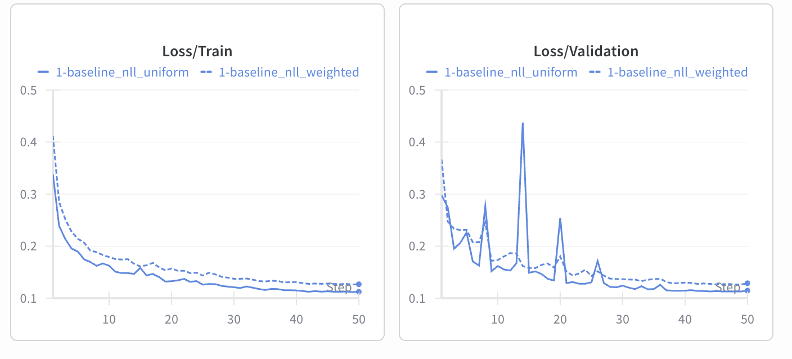


This behaviour can also be observed in the mIoU curves below, where the unweighted configuration converges to a slightly higher validation mIoU than the weighted version. 

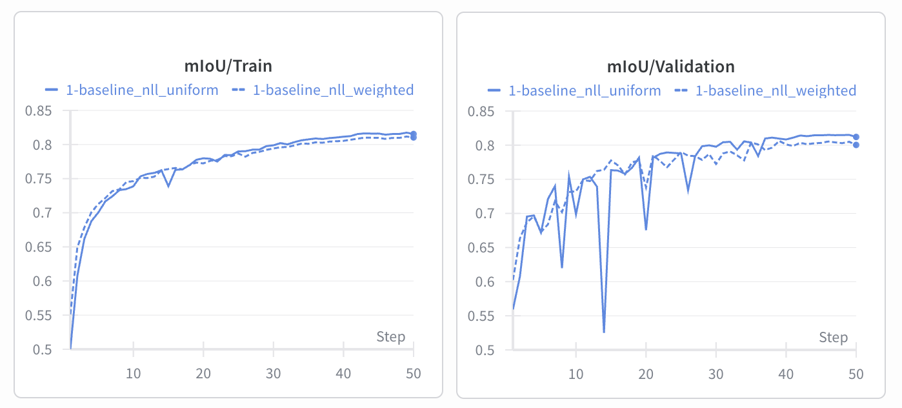
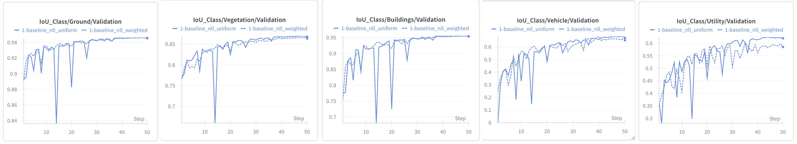

Regarding class IoU, curves indicate that for frequent classes such as Ground, Vegetation, and Buildings, both configurations behave almost identically. However, for rare classes like Vehicle and Utility, the weighted loss does not provide the expected improvement. In fact, the unweighted configuration slightly outperforms the weighted one in the final epochs.

These results suggest that PointNet++ already handles class imbalance reasonably well through its hierarchical architecture, which captures geometric structures at multiple spatial scales. In contrast to PointNet, where strong class weighting was beneficial, the same weighting scheme appears to slightly degrade performance in the PointNet++ setting, specially for rare classes such as Vehicle and Utility.

Regarding the changes with respect to the baseline, frequent classes like Ground, Vegetation and Building behave similar for all experiments showing almost identical IoU values. Rares classes like Vehicle and Utility are the ones that show more variability. Although such variability is not uniform among experiments, their overall mIoU values indicate two clear benefitial modifications: dropout (experiment 2) and number of neighbours (experiment 3). 

- **Effect of Dropout** 
  
  Reducing the dropout rate from 0.5 to 0.3 produces a small but consistent improvement across most metrics. In both weighted and unweighted settings, the dropout configuration achieves a validation mIoU of 0.813 and slightly better performance for several classes. This impacts in one of the best mIoU values.

- **Effect of Neighborhood Size (K-neighbors)**
  
  Experiment 3 increases the number of neighbors in the deeper abstraction layers from [32,32,32,32] to [32,32,64,64]. The resulting performance is slightly higher than the baseline across most metrics. 

  One noticeable effect is a slight improvement of the IoU for the Vehicle class. Vehicles are relatively small and sparse objects in the scene, and a larger neighborhood allows the network to capture a larger spatial context around them. This additional context can help distinguish vehicles from surrounding structures. In contrast, results show that the Utility class does not benefit from larger neighborhoods. Utility objects such as poles and street lights are thin vertical structures that contain very few points. Increasing the neighborhood size quickly introduces points from other classes, making the context less pure.

  This variability indicates a strong tradeoff between the size of the structure to identify and the size of the neighbourhood providing context, what seems to provide useful semantinc context for one class, may hurt another. 

- **Effect of Grouping Strategy**
  
  The knn strategy is robust in sparse areas because it guarantees enough number of points (fixed), which translates into a stable input to the network. However, the spatial size of the neighborhood varies depending on point density. In contrast, ball-based strategies select points within a fixed spatial radius r, which ensures that the neighbourhood always corresponds to the same physical scale. However, may contain very few points depending on the point density. This variability in the number of points can lead to unstable feature aggregation, particularly for small or sparsely sampled classes.

  This behaviour is shown in our experiments, the ball-based grouping strategies slightly degrade performance compared to the knn baseline, particularly for the Vehicle and Utility classes which contain relatively few points. 


- **Effect of Input Feature Channels**

  Experiment 6 evaluates the impact of removing additional input features and using only the XYZ coordinates. As expected, this configuration consistently produces the lowest performance across all metrics, indicating the importance of includding non-geometric features if available. This effect is particularly visible for the Vehicle and Utility classes, which already contain relatively few points. Without the additional feature channels, the model has less information to separate these objects from surrounding structures.


#### Final Model

Overall, the experiments suggest that the baseline PointNet++ configuration is already close to optimal for this dataset. Among the tested configurations, reducing the dropout rate (Experiment 2) and increasing the neighborhood size (Experiment 3) produced the most consistent improvements over the baseline. To evaluate whether both improvements could be combined, a final experiment was performed using both modifications simultaneously. This configuration achieved the highest overall performance, reaching a best validation mIoU of 0.818 during the training, slightly outperforming the individual experiments.

However, the improvements are not uniform across all classes. While the combined model improves the IoU of some classes (e.g., Utility), other classes show only marginal changes. This suggests that the effects of these hyperparameters are not strictly additive and may interact during training. Based on the overall mIoU, the combined configuration is selected as the final model and evaluated on the test set.

| NLL unweighted       |    grouping    |    dropout   |      K-neighbors      |              feature channels          | 
|:---------:|:--------------:|:------------:|:-----------------------:|:------------------------------------:|
|  FINAL MODEL    |   `knn`     |      0.3     | [32,32,64,64] (exact K) | [xyz,return_number,number_of_returns]|


| NLL unweighted |   FINAL MODEL <br> (train / val)   | FINAL MODEL <br>(test set) |
|:--------------|:-----------------:|:-------:|
| **Overall metrics** |             |         |
| mIoU          | 0.819 / **0.813** | `0.804` |
| Loss          | 0.110 / 0.115     | `0.103` |
| Accuracy      | 0.961 / **0.958** | `0.965` |
| **Class IoU** |                   |         |
| Ground        | 0.952 / **0.946** | `0.960` |
| Vegetation    | 0.873 / 0.868     | `0.885` |
| Buildings     | 0.955 / 0.953     | `0.947` |
| Vehicle       | 0.698 / 0.677     | `0.676` |
| Utility       | 0.616 / **0.621** | `0.550` |
| **Best validation** |             |         |
| Best mIoU     | ----- / **0.818** |         |
<!-- | Best Loss     | ----- / 0.112     |         |
| Best Accuracy | ----- / **0.959** |         | -->

---

## Comparing Three Architectures (Validation and Test Sample Results)

| Architecture | mIoU | Buildings | Ground | Utility | Vegetation | Vehicle |
|---|:---:|:---:|:---:|:---:|:---:|:---:|
| PointNet | 0.660 / 0.656 ($\color{red}{−0.004}$) | 0.852 / 0.856 ($\color{green}{+0.004}$) | 0.932 / 0.951 ($\color{green}{+0.019}$) | 0.378 / 0.329 ($\color{red}{−0.049}$) | 0.779 / 0.792 ($\color{green}{+0.013}$) | 0.359 / 0.355 ($\color{red}{−0.004}$) |
| IPointNet | 0.767 / 0.759 ($\color{red}{−0.008}$) | 0.922 / 0.916 ($\color{red}{−0.006}$) | 0.936 / 0.951 ($\color{green}{+0.015}$) | 0.575 / 0.522 ($\color{red}{−0.053}$) | 0.841 / 0.856 ($\color{green}{+0.015}$) | 0.562 / 0.552 ($\color{red}{−0.010}$) |
| PointNet++ | 0.813 / 0.804 ($\color{red}{−0.009}$) | 0.953 / 0.947 ($\color{red}{−0.006}$) | 0.946 / 0.960 ($\color{green}{+0.014}$) | 0.621 / 0.550 ($\color{red}{−0.071}$) | 0.868 / 0.885 ($\color{green}{+0.017}$) | 0.677 / 0.676 ($\color{red}{−0.001}$) |

*Values shown as Val / Test (delta). Classes ordered by decreasing frequency.*

Each architectural step brought a clear improvement: adding BEV fusion to PointNet (IPointNet) raised mIoU by +0.11 on validation, and replacing the flat architecture with hierarchical set abstraction (PointNet++) added another +0.05. Across all experiments documented above, the most impactful design choices were input feature selection (+0.045 mIoU from return metadata), class-balanced sampling for PointNet, local BEV fusion over global fusion in IPointNet, and the combination of lower dropout with larger neighborhood sizes in PointNet++.

The val→test deltas are small and consistent across all three architectures, confirming good generalization. Ground and Vegetation consistently improve on test, while Utility remains the weakest class and shows the largest drops - thin, sparse structures like poles and wires remain the main open challenge. These findings motivate the future directions below: richer input features (intensity, RGB), multi-scale BEV fusion inside PointNet++, and systematic hyperparameter search.


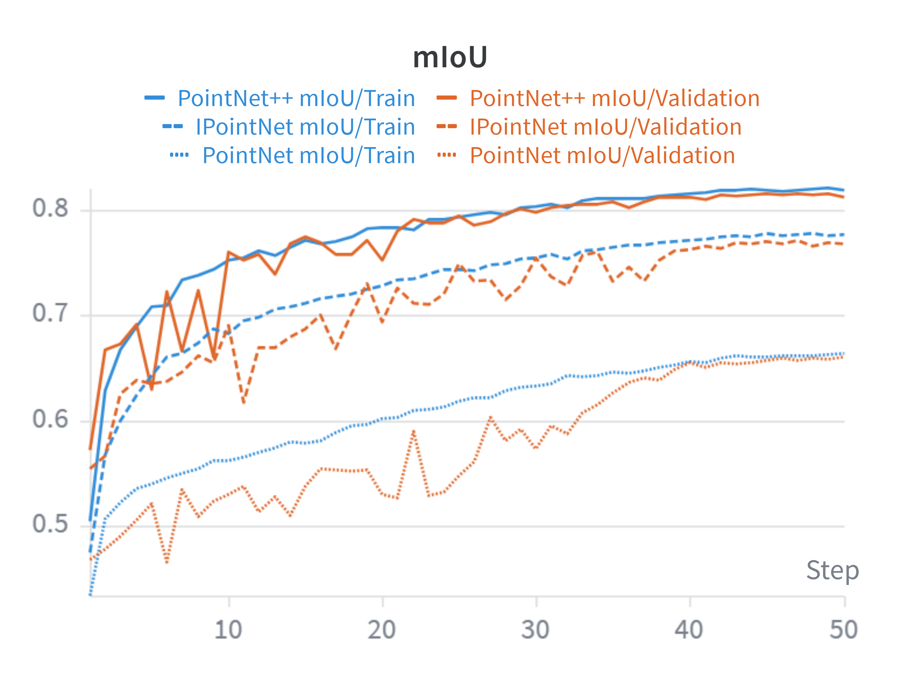

|   | mIoU | Ground | Vegetation | Buildings | Vehicle | Utility |
|---|:---:|:---:|:---:|:---:|:---:|:---:|
| **PointNet** | 0.66 | 0.95  | 0.79 | 0.86 | 0.36 | 0.33 |
| **IPointNet** | 0.76 | 0.95 | 0.86 | 0.92 | 0.55 | 0.52 |
| **PointNet++** | $\color{green}{0.80}$ | 0.96 | $\color{green}{0.89}$ | $\color{green}{0.95}$ | $\color{green}{0.68}$ | $\color{green}{0.55}$ |


---

## Future Work

**1. GreenSegNet on DALES**

GreenSegNet is a lightweight semantic segmentation network designed for outdoor point clouds. Investigating whether it transfers to aerial LiDAR data from DALES would be a natural next step, particularly given its lower computational budget compared to PointNet.

**2. Explore Datasets** 

Dales is a widely used dataset, but lacks the LiDAR intensity channel, that we would like to use as an extra channel.
There are datasets that also include RGB images from aereal captures, commonly setup together, information from extra sensors will contribute in more sematic information that may help in improving the achieved results.


**3. Systematic hyperparameter search with Ray Tune**

`src/tune_ray.py` and `src/utils/trainer_for_ray.py` are already implemented. Running a structured sweep over learning rate, dropout, batch size, loss function, and focal loss parameters would yield further gains over the manual trial-and-error experiments documented here, without additional architectural changes.

**4. Image encoder in PointNet++**

We have demonstrated that the BEV images generated from the pointcloud contributes in the segmentation task, implementing the encoder results in the PointNet++ architecture, we expect to improve the obtained results.