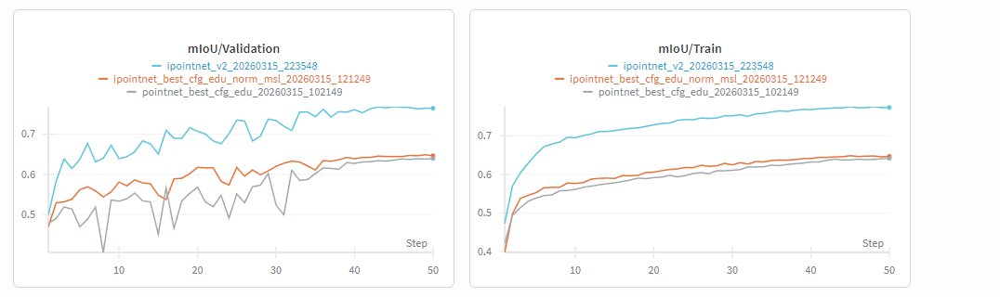
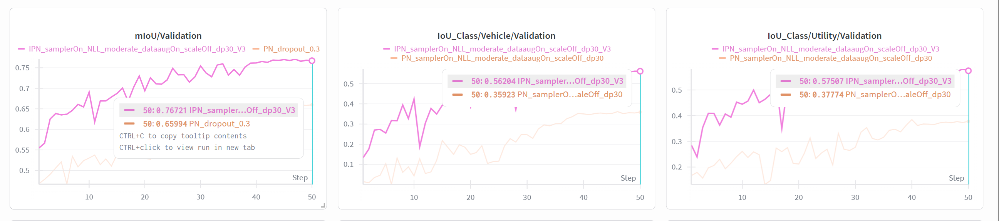

## IPOINTNET: BEV-POINT CLOUD FUSION

IPointNet: BEV-Point Cloud Fusion

In this work, we extend the PointNet architecture by integrating Bird’s Eye View (BEV) representations with 3D point clouds to improve semantic segmentation performance on the DALES dataset. While PointNet learns directly from unordered point sets, it has limited ability to capture larger spatial context. To overcome this limitation, we introduce a multi-modal pipeline that combines local 3D geometry with 2D spatial context derived from BEV images.

---

### FULL-DENSITY BEV GENERATION

We generate dense BEV raster images directly from the raw .las files, without any PointNet subsampling. The same 50 m × 50 m sliding windows used for point-cloud blocks are applied to create perfectly aligned BEV tiles.

Each BEV image has a resolution of 256 × 256 pixels and contains four channels:

Density (log(1 + number of points))
Z max (maximum elevation)
Z mean (average elevation)
Z range (height variation)

Full-density BEV representation showing density and height statistics

This representation preserves global spatial structure and captures geometric properties that are not directly accessible from local point neighborhoods. The BEV images are stored as compressed NumPy files (.npz) for efficient loading and training. ([`generate_full_density_bev_rasters_from_las.py`](./src/generate_full_density_bev_rasters_from_las.py))

---

### POINT CLOUD AND BEV ALIGNMENT

A key contribution of this work is the precise alignment between point-cloud blocks and BEV images. During preprocessing, each point-cloud block stores metadata that allows deterministic matching with its corresponding BEV tile.

In addition to the standard PointNet preprocessing, we store:

Block origin (x0, y0)
Tile indices (tile_ix, tile_iy)
BEV filename for direct lookup
Per-point XY coordinates in BEV space (xy_grid)

The xy_grid encodes the position of each point inside the BEV tile using normalized coordinates in the range [-1, 1]. This enables exact spatial correspondence between the 3D point cloud and the 2D BEV representation.

([`convert_las_to_blocks.py`](./src/convert_las_to_blocks.py))

---

### IMAGE ENCODER AND INITIAL GLOBAL FEATURE VECTOR

Initially, we used a convolutional image encoder to extract a global feature vector (fvect) from the BEV image. This encoder progressively reduces spatial resolution through convolution and pooling layers, followed by global average pooling.

The resulting vector summarizes the entire BEV tile into a single descriptor. This vector was then broadcast and concatenated to all points in the block.

However, this approach did not improve performance. The reason is that global pooling removes all spatial information, meaning that every point receives identical BEV context regardless of its location.

---

### LOCAL PER-POINT BEV FEATURE 

To address this limitation, we implemented a local fusion strategy that preserves spatial alignment at the point level.

Instead of using the global feature vector, we use the spatial feature map produced by the image encoder ([`img_encoder.py`](./src/img_encoder.py)). This feature map preserves spatial information and provides per-point feature extraction through interpolation.

This operation assigns each point a BEV feature that represents its local neighborhood:

Points in dense regions receive high-density features
Points on buildings capture height structure
Points near utilities capture vertical variation patterns

This local sampling is implemented using PyTorch’s grid_sample operation inside the IPointNet architecture.

---

### IMPLICIT BEV NEIGHBORHOOD

The BEV neighborhood is not explicitly defined by a radius. Instead, it emerges from:

The BEV resolution (≈ 0.2 m per pixel)
The receptive field of the convolutional encoder

As a result, each point receives contextual information corresponding to approximately 2–3 meters around its location. This provides mid-scale spatial context that complements the fine-grained geometry captured by PointNet.

---

### IPOINTNET ARCHITECTURE

The final IPointNet model extends the standard PointNet segmentation pipeline by incorporating BEV features.
The implementation of both PointNet and IPointNet architectures can be found in [`pointnet.py`](./src/models/pointnet.py), specifically in the `IPointNetSegmentation` class.

For each point, the model concatenates:

Local PointNet features
Global PointNet feature
Locally sampled BEV feature

These combined features are processed through shared multilayer perceptrons to predict semantic labels.

---

### RESULTS

The integration of BEV features leads to a significant improvement in segmentation performance.

PointNet baseline: ~0.64 mIoU  
IPointNet: ~0.76 mIoU  

This corresponds to:

+0.11 – +0.12 absolute mIoU improvement  
~19% relative improvement  

Training and validation curves showing stable convergence

At the class level, the most significant gains are observed in:

Vehicles: +20 IoU  
Utility structures (poles, power lines, fences): +20 IoU  

These classes benefit strongly from spatial context such as density patterns and height variation.

---

### KEY INSIGHT

The main finding of this work is that BEV fusion is only effective when spatial alignment is preserved at the point level.

Global fusion (single vector per image) does not provide useful information for segmentation. In contrast, local feature sampling allows each point to access context from its own spatial neighborhood, leading to substantial performance gains.

---

### CONCLUSION

IPointNet demonstrates that combining 3D point-based learning with 2D BEV representations significantly improves semantic segmentation of aerial LiDAR data. The key enabler is the preservation of spatial correspondence between modalities and the use of local feature fusion.

Future work may explore multi-scale BEV representations, attention-based fusion mechanisms, and integration with more advanced point-cloud architectures such as PointNet++.